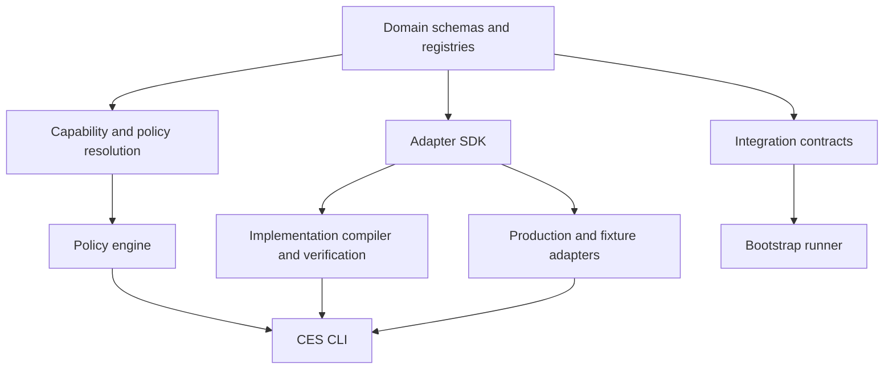

# CES workspace architecture

The fail-closed dependency matrix in `tests/architecture.test.ts` is the
machine-enforced source for package edges. Every workspace package must appear
in that matrix, and every workspace dependency must be explicitly allowed.

Layer rules:

- Domain schemas and registries have no delivery, CLI, runner, compiler, or
  adapter dependencies.
- Resolution and policy compilation depend only on approved domain layers.
- Adapters depend inward on the SDK and portable contracts.
- Integration contracts depend only on the project contract.
- The bootstrap runner depends on integration and project contracts, never a
  concrete adapter.
- The CLI is the composition root.

Checks cover declared workspace dependencies, static and dynamic imports,
relative cross-package imports, and cycles. Unknown packages and edges fail
closed.
