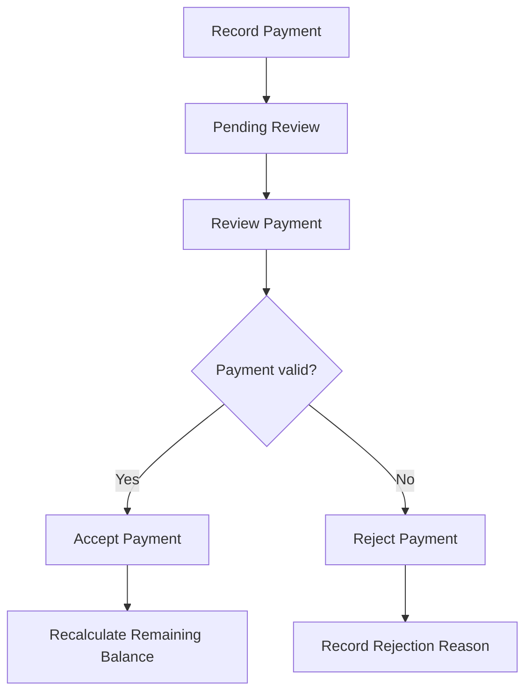

# CES Atlas Workflow UI Context

## Purpose

The Atlas Workflow UI is a human-review and approval workspace for workflow semantics extracted from a buyer's PRD.

It is not:

- a workflow execution engine;
- a BPMN designer;
- the semantic source of truth;
- a place where the frontend invents relationships;
- a replacement for the canonical `ProposedProjectModel`.

Its purpose is to help a buyer, analyst, or reviewer understand:

```text
What workflows exist?
What happens inside each workflow?
Which rules control each step?
Where did each interpretation come from?
Which interpretations still require review?
```

---

# 1. Architectural Position

```text
Source Documents
        |
        v
Atomic Claims
        |
        v
Canonical Semantic Records
        |
        v
Workflows + Operations + States + Decisions
        |
        v
Assignments + Relationship Candidates
        |
        v
ProposedProjectModel
        |
        v
Backend-Owned UI Projections
        |
        v
Human Review and Approval
        |
        v
ApprovedProjectModel
```

The UI renders backend-owned projections.

It must not independently decide:

- which rule belongs to which workflow;
- which operation follows another;
- where a branch goes;
- whether a relationship is explicit or derived;
- whether an item is safe for bulk approval.

---

# 2. Lifecycle Shown in the UI

Before approval:

```text
PROPOSED
NOT APPROVED
NON-AUTHORITATIVE
DOWNSTREAM BLOCKED
```

```json
{
  "lifecycle": "proposed",
  "authoritative": false,
  "approval_required": true,
  "downstream_execution_allowed": false
}
```

After approval:

```text
APPROVED
AUTHORITATIVE
DOWNSTREAM ALLOWED
```

The original proposal remains immutable.

```text
Immutable ProposedProjectModel
+ Immutable Human Decisions
= ApprovedProjectModel
```

---

# 3. Intended Screen Layout

The recommended interface is a three-pane workspace.

```text
+--------------------------------------------------------------------------------+
| Project: Safara Buyer PRD                 PROPOSED - NOT APPROVED               |
| Workflows: 11 | Records: ... | Eligible: ... | Exceptions: ...                |
+----------------------+--------------------------------------+------------------+
| Workflow Navigation  | Workflow Workspace                   | Source Workspace |
|                      |                                      |                  |
| Access and Roles     | [Flow] [Rules] [Validations]         | Document list    |
| Packages             | [Permissions] [States]               |                  |
| Pilgrim Data         | [Evidence] [Approval]                | Selected PDF      |
| Registration         |                                      |                  |
| > Payments           | Payment workflow                     | Exact page and    |
| Documents            |                                      | source highlight  |
| Readiness            | Record -> Review -> Decision         |                  |
| Manifest             |                                      |                  |
| Reports              |                                      |                  |
+----------------------+--------------------------------------+------------------+
```

---

# 4. Left Panel: Workflow Navigation

The left panel lists major workflow areas.

For Safara:

```text
Access and User Roles
Packages and Departure Schedules
Pilgrim Data
Pilgrim Registration
Payments
Documents
Departure Readiness
Manifest
Dashboard and Reports
Activity and Audit History
```

Each workflow may show:

```text
operation count
rule count
pending review count
exception count
workflow status
```

Example:

```text
Payments
8 operations
12 rules
3 pending relationships
1 exception
```

Selecting a workflow updates the center workspace.

---

# 5. Center Panel: Workflow Workspace

Each workflow should expose focused tabs:

```text
[Flow]
[Rules]
[Validations]
[Permissions]
[States]
[Evidence]
[Approval]
```

Empty tabs may be hidden.

## 5.1 Flow

Shows:

- operations;
- decisions;
- states;
- branches;
- joins;
- correction loops;
- dependencies;
- approved or proposed ordering.

Example:

```text
Record Payment
      |
      v
Pending Review
      |
      v
Review Payment
      |
      v
Payment Valid?
  /           \
 Yes           No
  |             |
  v             v
Accept         Reject
  |             |
  v             v
Update         Record Rejection
Balance        Reason
```

The flow comes from governed topology records, not frontend inference.

## 5.2 Rules

Shows business rules related to the workflow.

```text
Only Accepted payments reduce the remaining balance.
Payment references must be unique.
Rejected payments require a reason.
```

## 5.3 Validations

Shows field and operation constraints.

```text
NIK must contain exactly 16 digits when provided.
Passport number duplication must trigger a warning.
Required data must be completed before registration.
```

## 5.4 Permissions

Shows which actors may perform which operations.

```text
Finance may review payments.
Operations may review documents.
Only authorized users may finalize a manifest.
```

## 5.5 States

Shows business states and transitions.

```text
Pending Review
Accepted
Rejected
Blocked
Ready
Finalized
```

The tab should also show which operations produce or require each state.

## 5.6 Evidence

Shows traceability:

```text
Document
-> Source Unit
-> Atomic Claim
-> Canonical Record
-> Workflow
-> Operation
```

## 5.7 Approval

Shows review controls for:

- semantic records;
- workflow assignments;
- relationship candidates;
- branch targets;
- ordering;
- state transitions.

Possible decisions:

```text
Approve
Reject
Request Correction
Reclassify
Change Assignment
Add Relationship
Remove Relationship
Split
Merge
```

---

# 6. Right Panel: Source Workspace

The right panel starts with the source-document list.

Selecting an item should open:

- the correct document;
- the correct page;
- the exact source unit;
- the exact text span;
- the bounding box when available.

Example:

```text
Selected item:
NIK length validation

Original statement:
"NIK harus terdiri dari 16 angka apabila diisi."

Source:
Safara Buyer PRD
Page 3
Section: Pilgrim Data
```

The original wording remains evidence.

Translated or canonical wording is an interpretation aid.

---

# 7. Project Overview Versus Workflow Detail

Atlas should not put every rule in one graph.

## 7.1 Project Overview

Answers:

```text
What are the major business workflows?
```

Example:

```text
Package and Departure Setup
            |
            v
    Pilgrim Registration
       /            \
      v              v
Payment Processing  Document Processing
       \              /
        v            v
      Readiness Evaluation
              |
              v
      Manifest Finalization
              |
              v
     Dashboard and Reporting
```

Only major workflow structure belongs here.

## 7.2 Workflow Detail

Answers:

```text
How does this workflow operate?
```

Example:

```text
Record Payment
-> Pending Review
-> Review Payment
-> Accept or Reject
-> Update Balance or Record Reason
```

Detailed rules remain in tabs rather than becoming permanent overview nodes.

---

# 8. Relationship Review

Pending relationship candidates must not appear as established truth.

A dedicated relationship-review projection should show:

```text
From:
Review Payment

To:
Accept Payment

Type:
branches_to

Condition:
payment_is_valid

Origin:
derived

Confidence:
0.94

Evidence:
PRD page 4

Status:
pending
```

Pending edges may use dashed lines.

Approved edges use solid connections.

Rejected edges do not appear in approved projections.

---

# 9. Backend-Owned Projections

The backend should generate:

```text
Project Overview
Workflow Detail
Rules and Controls
Source Traceability
Approval Exceptions
Relationship Review
```

Recommended artifacts:

```text
proposed-project-overview-graph.json
proposed-workflow-detail-graphs.json
proposed-rules-controls-index.json
proposed-traceability-graph.json
proposed-approval-exceptions.json
proposed-relationship-review.json
```

Per-workflow artifacts:

```text
proposed-workflows/
  payment/
    flow.json
    flow.mmd
    rules.json
    validations.json
    permissions.json
    relationship-candidates.json
```

The frontend should not download the complete semantic inventory only to render one workflow.

---

# 10. Mermaid Output

Mermaid is a readable projection and export format.



Mermaid is not canonical data.

It is regenerated from the canonical model and governed relationships.

---

# 11. Bulk Approval

The backend owns bulk-approval eligibility.

```json
{
  "bulk_approval_eligible": false,
  "bulk_approval_blockers": [
    "derived_topology_requires_review",
    "low_confidence_assignment"
  ]
}
```

Common blockers:

```text
ambiguous records
conflicting records
uncovered atomic claims
low-confidence assignments
derived ordering
derived branches
missing source evidence
unapproved human-added relationships
```

---

# 12. Approved UI Result

After approval, accepted assignments and relationships are materialized into:

```text
approved-project-model.json
approved-workflow-assignments.json
approved-relationships.json
approved-project-overview-graph.json
approved-workflow-detail-graphs.json
approved-workflows/*/flow.mmd
```

The approved UI shows only:

- approved semantic records;
- approved assignments;
- approved or human-confirmed ordering;
- approved states and transitions;
- approved branches;
- approved cross-cutting controls.

Pending or rejected candidates must not appear as authoritative.

---

# 13. Current Implementation Gap

The current implementation already finds:

```text
workflows
operations
workflow assignments
relationship candidates
```

It still lacks:

```text
operation grouping quality
operation-to-operation ordering
decision nodes
branch conditions
state nodes
state transitions
loops and joins
approved relationship replay
connected Mermaid projections
```

The current UI can show:

```text
Payments exists.
These rules are related to Payments.
These operations may belong to Payments.
```

It cannot yet reliably show:

```text
Record Payment
-> Review Payment
-> Payment Valid?
   -> Accept
   -> Reject
```

That connected topology remains the work of reopened `HARD-021` through `HARD-026`.

---

# 14. Final UI Principle

> The Atlas Workflow UI is a source-grounded approval workspace that presents one complete canonical model through several focused workflow projections.

The project overview answers:

```text
What are the main business workflows?
```

The workflow detail answers:

```text
How does this business process operate?
```

The rules and controls tabs answer:

```text
What exact requirements govern this workflow?
```

The source workspace answers:

```text
Where did this interpretation come from?
```

The approval workspace answers:

```text
Which interpretations are safe to accept, and which require correction?
```
