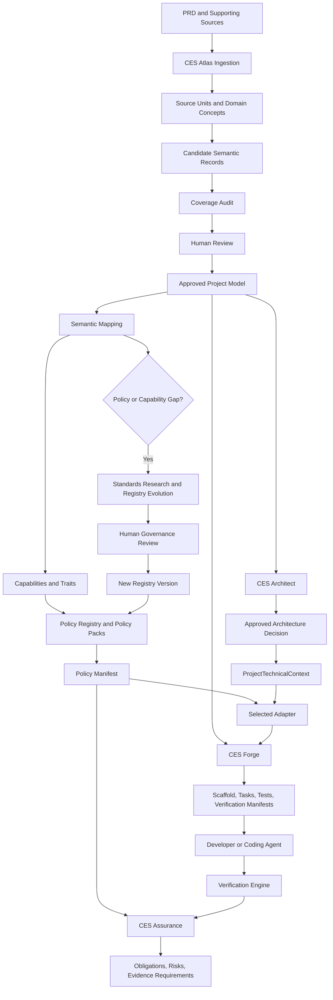

# CES Dynamic Atlas and Policy Evolution Update

**Status:** Proposed architecture and implementation update  
**Repository:** `adityaa11/ces-platform`  
**Primary branch context:** `worker1`  
**Primary priority:** Fix CES Atlas so it can extract all business requirements and business rules from realistic PRDs without being constrained by the current static project-management and file-upload vocabulary.  
**Secondary priority:** Make the downstream CES lifecycle consume the same approved business model and allow the capability, policy, assurance, Forge, and verification layers to evolve through governed, versioned registries.

---

## 1. Executive Summary

The current CES direction remains valid:

```text
Natural-language PRD
        ↓
CES Atlas
        ↓
Approved Requirement Collection and system-intent graph
        ↓
CES Architect
        ↓
Approved Architecture Decision and ProjectTechnicalContext
        ↓
Existing deterministic CES core
        ↓
Policy Manifest
        ↓
CES Assurance
        ↓
Selected adapter
        ↓
CES Forge
        ↓
Developer or coding agent implementation
        ↓
Existing verification engine
        ↓
CES Assurance status update
```

The required change is not a rewrite of the four-product architecture. The necessary work is an internal expansion of Atlas and the shared project model so that:

1. Atlas can understand arbitrary business domains without requiring all actors, resources, actions, states, and business concepts to exist in static TypeScript enums.
2. Atlas can prove extraction completeness rather than only proving schema validity and provenance.
3. Human review can see both extracted candidates and uncovered source statements.
4. Atlas publishes one approved, versioned canonical business model.
5. Architect, the deterministic CES core, Assurance, Forge, and Verification consume the same approved model revision and do not independently reinterpret the original PRD.
6. Capabilities, traits, and policies become controlled but extensible through pinned, versioned registries and packs.
7. When an approved business rule requires an engineering policy that does not exist, CES detects the policy gap, inspects existing policies, researches authoritative international standards through an agent, proposes the smallest justified change, requires human approval, publishes a new immutable registry version, and performs impact analysis.

The target principle is:

> Dynamic, domain-open business understanding before approval; controlled, deterministic, versioned engineering interpretation after approval.

---

## 2. Problem Statement

The current Atlas pipeline can produce structurally valid output while still omitting many business requirements.

A realistic PRD may contain:

- business goals;
- actors and role responsibilities;
- functional requirements;
- data fields;
- validation rules;
- calculations;
- state models;
- permission rules;
- workflow constraints;
- capacity constraints;
- history-retention rules;
- audit requirements;
- reports and filters;
- export requirements;
- acceptance criteria;
- test scenarios;
- deliverables;
- unresolved facts and conflicts.

The current candidate model and vocabulary are too narrow when they only support a small fixed set of concepts such as:

```text
authenticated_user
company_administrator
company_member
project_manager
system

project
task
user
membership
invitation
profile_picture
```

Likewise, the current policy registry is effectively centered around one file-upload/profile-picture scenario:

```text
INPUT_VALIDATION
RESOURCE_LEVEL_AUTHORIZATION
FILE_SIZE_LIMIT
FILE_MEDIA_TYPE_ALLOWLIST
FILE_CONTENT_VERIFICATION
SERVER_GENERATED_STORAGE_KEY
SAFE_IMAGE_DELIVERY
ATOMIC_RESOURCE_REPLACEMENT
REPLACED_RESOURCE_LIFECYCLE
SAFE_LOGGING
```

These policies remain useful, but they cannot remain the entire CES policy universe.

The result is two bottlenecks:

```text
Static extraction vocabulary
→ Atlas cannot represent arbitrary business meaning faithfully.

No source-coverage gate
→ CES does not detect that Atlas omitted business requirements.
```

After Atlas is corrected, a third bottleneck appears:

```text
Small hard-coded capability, trait, and policy registries
→ downstream CES can only govern the scenarios already encoded in source code.
```

---

## 3. Architectural Principles

### 3.1 Preserve the deterministic core

The existing deterministic boundary remains authoritative:

```text
Approved Requirement Package or approved project model
+ approved business rules
+ ProjectAssuranceContext
+ Capability Registry
+ Policy Registry
→ Policy Manifest
```

The core must remain:

- stack-agnostic;
- agent-neutral;
- deterministic for pinned approved inputs;
- reproducible through exact versions and hashes;
- unable to consume unreviewed agent output directly.

### 3.2 Agents discover and propose; humans govern meaning

Agents may:

- detect document structure;
- discover domain terminology;
- extract candidate requirements and business rules;
- classify semantic record kinds;
- detect uncertainty, contradiction, overlap, and possible omissions;
- propose capability and policy mappings;
- research authoritative standards;
- propose registry additions, revisions, merges, deprecations, trigger changes, and evidence changes;
- assist semantic review.

Agents must not:

- approve their own inferred requirement;
- write directly to stable registries;
- modify approved requirements silently;
- weaken an approved Policy Manifest;
- mark a policy as verified without evidence;
- claim certification or compliance from generated text;
- mutate an approved registry version in place.

### 3.3 Business truth and engineering derivation are separate

Example business rule:

```text
Only accepted payments reduce the outstanding balance.
```

Possible engineering implications:

```text
AUTHORITATIVE_CALCULATION
SERVER_SIDE_BUSINESS_RULE_ENFORCEMENT
TRANSACTIONAL_CONSISTENCY
AUDITABLE_STATE_TRANSITION
BUSINESS_RULE_TESTING
```

The business rule belongs to the approved project model. The engineering implications are derived by CES and may evolve independently through registry versions.

### 3.4 Dynamic does not mean uncontrolled

The desired model is:

```text
Dynamic business concepts
+ stable semantic record shapes
+ reviewed mappings
+ controlled versioned registries
+ deterministic compilation
```

Not:

```text
An agent invents arbitrary policies and directly changes the system.
```

### 3.5 Every approved business record must receive a downstream disposition

Not every business requirement creates a policy. Each approved semantic record must be classified downstream as one of:

```text
mapped_to_existing_policy
mapped_to_existing_capability
implementation_only
architecture_only
verification_only
policy_gap
capability_gap
clarification_required
not_applicable_with_reason
```

No approved record may disappear silently.

---

## 4. Broad CES Product Lifecycle

The four customer-facing products remain product views and orchestration layers over one shared knowledge model.



---

# Part I — First Priority: Fix CES Atlas

## 5. Atlas Target Outcome

Atlas must convert one or more business documents into a complete, traceable, reviewable, approved project model.

Atlas should not be evaluated only by whether it generated valid JSON. It must be evaluated by whether every requirement-bearing source statement was accounted for.

The first priority is:

> A realistic PRD must not be considered successfully extracted while normative source statements remain uncovered.

---

## 6. Atlas Data Layers

Atlas should use four layers.

### 6.1 Layer 1 — Immutable source model

This contains the buyer-provided source without semantic rewriting.

Example:

```json
{
  "source_unit_id": "SRC-SAFARA-P6-008",
  "document_id": "PRD-MAIN",
  "page": 6,
  "section_id": "SEC-BUSINESS-RULES",
  "section_title": "Aturan Bisnis Utama",
  "text": "Semua alasan yang menghambat kesiapan harus ditampilkan bersamaan.",
  "content_hash": "sha256:...",
  "source_kind": "pdf_native_text"
}
```

Rules:

- Source bytes remain immutable.
- Normalized source text remains traceable to page, section, and position.
- Agents may reference source units but cannot rewrite them.
- Every candidate semantic record must reference one or more source units.

### 6.2 Layer 2 — Dynamic candidate semantic model

Candidate values are domain-open, but candidate shapes are schema-controlled.

Atlas may create project-scoped concepts such as:

```text
owner_admin
finance
operations
pilgrim
departure_schedule
registration
payment
passport
visa
insurance
ticket
manifest
readiness
```

These concepts do not need to exist in global CES enums before extraction.

Example candidate business rule:

```json
{
  "candidate_id": "CAND-BR-READINESS-008",
  "kind": "business_rule",
  "statement": "All readiness blockers must be displayed together.",
  "subject_concept_ids": ["pilgrim_readiness"],
  "constraints": {
    "quantifier": "all",
    "presentation": "simultaneous"
  },
  "source_unit_ids": ["SRC-SAFARA-P6-008"],
  "origin": "explicit",
  "confidence": 0.98,
  "review_status": "needs_confirmation"
}
```

### 6.3 Layer 3 — Approved canonical project model

After coverage checks and human review, Atlas publishes one immutable revision of the project’s approved business truth.

Suggested name:

```text
ApprovedProjectModel
```

Alternative acceptable names:

```text
ApprovedSystemIntent
CanonicalProjectModel
```

The exact name is less important than the contract.

### 6.4 Layer 4 — Deterministic CES engineering model

The approved project model becomes input to:

- semantic mapping;
- capability and trait resolution;
- policy compilation;
- architecture characteristic resolution;
- Assurance traceability;
- Forge planning;
- verification planning.

No downstream product should re-read and reinterpret the original PDF independently.

---

## 7. Dynamic Semantic Record Model

Do not force every requirement into only:

```text
actor + action + resource
```

Introduce a discriminated union of semantic record kinds.

Minimum initial types:

```text
functional_requirement
business_rule
permission_rule
data_requirement
validation_rule
calculation_rule
state_model
workflow_rule
report_requirement
acceptance_criterion
deliverable
nonfunctional_requirement
```

Recommended TypeScript direction:

```typescript
export type SemanticRecord =
  | FunctionalRequirementRecord
  | BusinessRuleRecord
  | PermissionRuleRecord
  | DataRequirementRecord
  | ValidationRuleRecord
  | CalculationRuleRecord
  | StateModelRecord
  | WorkflowRuleRecord
  | ReportRequirementRecord
  | AcceptanceCriterionRecord
  | DeliverableRecord
  | NonFunctionalRequirementRecord;
```

### 7.1 Validation rule example

```json
{
  "id": "VAL-PILGRIM-NIK-001",
  "kind": "validation_rule",
  "target_concept_id": "pilgrim.national_identity_number",
  "condition": {
    "operator": "when_present"
  },
  "constraint": {
    "type": "length",
    "value": 16,
    "character_set": "digits"
  },
  "source_unit_ids": ["SRC-SAFARA-P3-009"]
}
```

### 7.2 Calculation rule example

```json
{
  "id": "CALC-PAYMENT-BALANCE-001",
  "kind": "calculation_rule",
  "result_concept_id": "registration.outstanding_balance",
  "expression": {
    "operator": "subtract",
    "operands": [
      "registration.total_invoice",
      "registration.total_accepted_payments"
    ]
  },
  "source_unit_ids": ["SRC-SAFARA-P4-021"]
}
```

### 7.3 Permission rule example

```json
{
  "id": "PERM-FINANCE-PAYMENT-001",
  "kind": "permission_rule",
  "actor_concept_id": "finance",
  "action_concept_ids": ["record", "review", "accept", "reject"],
  "resource_concept_id": "payment",
  "source_unit_ids": ["SRC-SAFARA-P2-006"]
}
```

### 7.4 State model example

```json
{
  "id": "STATE-PAYMENT-001",
  "kind": "state_model",
  "concept_id": "payment",
  "states": ["pending_review", "accepted", "rejected"],
  "transitions": [
    {
      "from": "pending_review",
      "to": "accepted",
      "authorized_actor_ids": ["finance"]
    },
    {
      "from": "pending_review",
      "to": "rejected",
      "authorized_actor_ids": ["finance"],
      "required_fields": ["rejection_reason"]
    }
  ]
}
```

---

## 8. Project-Scoped Domain Dictionary

Atlas should maintain a project-scoped domain dictionary.

Example:

```json
{
  "domain_id": "umrah_travel_administration",
  "concepts": [
    {
      "concept_id": "pilgrim",
      "kind": "entity",
      "preferred_label": "Pilgrim",
      "source_labels": ["Jemaah"]
    },
    {
      "concept_id": "departure_schedule",
      "kind": "entity",
      "preferred_label": "Departure Schedule",
      "source_labels": ["Jadwal Keberangkatan", "Keberangkatan"]
    },
    {
      "concept_id": "pilgrim_readiness",
      "kind": "stateful_concept",
      "preferred_label": "Pilgrim Readiness",
      "source_labels": ["Kesiapan", "Siap", "Terhambat"]
    }
  ]
}
```

The dictionary prevents different extraction calls from creating duplicate synonyms such as:

```text
departure
departure plan
travel schedule
umrah schedule
departure schedule
```

Workflow:

```text
Agent proposes concept
→ deterministic normalization creates candidate concept ID
→ synonym and duplicate analysis
→ reviewer confirms or merges terminology
→ all semantic records reference the confirmed concept ID
```

Project concepts remain project-scoped unless governance later promotes a concept or semantic pattern into an organization registry.

---

## 9. Atlas Agent Architecture

Do not use one super-agent to read the full document, extract everything, certify completeness, map policies, and generate the graph.

Use bounded roles behind the existing provider-neutral agent interface.

### 9.1 Agent 1 — Document Structure Agent

Responsibilities:

- identify document sections;
- identify headings and hierarchy;
- classify sections as context, goals, roles, functional requirements, business rules, acceptance criteria, deliverables, and others;
- identify likely requirement-bearing ranges;
- preserve page and source references.

Outputs:

```text
document-structure.json
section-index.json
```

### 9.2 Agent 2 — Domain Discovery Agent

Responsibilities:

- identify actors;
- identify entities and resources;
- identify states and transitions;
- identify business terms and synonyms;
- identify data concepts;
- propose a project-scoped domain dictionary.

Output:

```text
domain-lexicon.candidate.json
```

### 9.3 Agent 3 — Section Requirement Extractor

Run once per section or bounded source-unit group.

Responsibilities:

- extract atomic semantic records;
- preserve each normative statement;
- avoid summarizing multiple independent rules into one broad requirement;
- reference exact source units;
- classify each record by semantic kind;
- report uncertainty rather than inventing details.

Outputs:

```text
section-candidates/<section-id>.json
```

### 9.4 Agent 4 — Coverage Critic

Receives:

- source units;
- extracted semantic records;
- source mappings;
- domain lexicon.

Responsibilities:

- identify normative source units with no semantic record;
- identify one candidate that incorrectly combines multiple independent statements;
- identify candidate distortions;
- identify source units incorrectly classified as context-only;
- identify duplicated candidates;
- propose targeted retry units.

Outputs:

```text
coverage-critic-report.json
missing-candidate-proposals.json
```

The coverage critic does not approve completeness. Deterministic code calculates the final coverage state.

### 9.5 Agent 5 — Semantic Mapping Advisor

This role is not required for the first Atlas completion milestone, but it is required for downstream policy and capability mapping.

Responsibilities:

- map approved project concepts into reusable engineering traits and capabilities;
- identify mapping gaps;
- propose the smallest justified mapping;
- avoid changing the original business meaning.

---

## 10. Deterministic Source-Unit Inventory

Before semantic extraction, CES must create deterministic source units.

A source unit should be small enough to classify and trace, but large enough to preserve meaning.

Possible unit boundaries:

- heading;
- paragraph;
- numbered item;
- bullet;
- table row;
- acceptance scenario;
- formula;
- role permission statement.

Recommended source-unit contract:

```typescript
export interface SourceUnit {
  sourceUnitId: string;
  documentId: string;
  sectionId: string;
  pageStart?: number;
  pageEnd?: number;
  lineStart?: number;
  lineEnd?: number;
  text: string;
  contentHash: string;
  sourceKind: "markdown" | "pdf_native_text" | "pdf_ocr";
  extractionConfidence?: number;
}
```

Source-unit IDs must be generated deterministically from stable document identity and normalized location, not from agent output.

---

## 11. Coverage Contract and Completion Gate

Every source unit must receive a disposition.

Recommended dispositions:

```text
covered
context_only
duplicate
uncertain
conflicting
excluded_with_reason
uncovered
```

Example covered unit:

```json
{
  "source_unit_id": "SRC-SAFARA-P6-008",
  "normative": true,
  "disposition": "covered",
  "semantic_record_ids": ["BR-READINESS-ALL-BLOCKERS"]
}
```

Example blocking unit:

```json
{
  "source_unit_id": "SRC-SAFARA-P6-009",
  "normative": true,
  "disposition": "uncovered",
  "semantic_record_ids": []
}
```

Deterministic completion logic:

```typescript
const blockingUnits = sourceUnits.filter((unit) =>
  unit.normative &&
  (unit.disposition === "uncovered" || unit.disposition === undefined)
);

const status = blockingUnits.length === 0
  ? "coverage_complete"
  : "incomplete_coverage";
```

Atlas must not publish an approved project model when normative units remain uncovered.

Recommended Atlas statuses:

```text
complete
incomplete_coverage
review_required
clarification_required
conflict
provider_error
input_error
```

---

## 12. Targeted Retry Strategy

Do not rerun the full document whenever coverage is incomplete.

Use:

```text
uncovered source units
+ nearby section context
+ current domain lexicon
+ current candidate records
→ targeted extraction retry
```

Benefits:

- lower token usage;
- less output instability;
- fewer regressions in already correct sections;
- easier testability;
- more precise failure reporting.

Set a bounded retry limit. If units remain uncovered after the limit, require human review or clarification.

---

## 13. Atlas Human Review

Review must show both extracted and missing information.

The reviewer should see:

```text
candidate semantic records
source sections
source units
coverage status
uncovered units
uncertainties
conflicts
domain terminology
mapping gaps
```

Required review actions:

```text
approve candidate
reject candidate
correct candidate
merge candidates
split candidate
create candidate from uncovered source unit
mark context-only with reason
mark duplicate with target
record clarification required
confirm or merge domain concept
```

A candidate-only review is insufficient because an omitted requirement never appears in the candidate list.

---

## 14. Approved Project Model

Suggested contract:

```typescript
export interface ApprovedProjectModel {
  schemaVersion: string;
  projectId: string;
  revisionId: string;
  contentHash: string;

  sourceDocuments: SourceDocument[];
  sourceUnits: SourceUnit[];
  domainConcepts: DomainConcept[];

  requirements: ApprovedFunctionalRequirement[];
  businessRules: ApprovedBusinessRule[];
  permissions: ApprovedPermissionRule[];
  dataRequirements: ApprovedDataRequirement[];
  validations: ApprovedValidationRule[];
  calculations: ApprovedCalculationRule[];
  stateModels: ApprovedStateModel[];
  workflows: ApprovedWorkflowRule[];
  reports: ApprovedReportRequirement[];
  acceptanceCriteria: ApprovedAcceptanceCriterion[];
  deliverables: ApprovedDeliverable[];
  nonfunctionalRequirements: ApprovedNonfunctionalRequirement[];

  uncertainties: Uncertainty[];
  conflicts: Conflict[];
  coverageReport: CoverageReport;
  reviewRecord: ReviewRecord;
}
```

Important rules:

- Logical IDs remain stable across revisions.
- Content hashes identify immutable revisions.
- Approved revisions are never mutated in place.
- Corrections create a new revision.
- Supersession relationships remain explicit.

---

## 15. Atlas Output Layout

Recommended output:

```text
.ces/generated/atlas/
├── source-index.json
├── document-structure.json
├── source-units.json
├── domain-lexicon.candidate.json
├── domain-lexicon.approved.json
├── section-candidates/
│   ├── SEC-001.json
│   ├── SEC-002.json
│   └── ...
├── candidate-semantic-records.json
├── candidate-requirements.json
├── candidate-business-rules.json
├── uncertainties.json
├── conflicts.json
├── source-coverage-map.json
├── coverage-critic-report.json
├── coverage-report.json
├── clarification-questions.md
├── review-decisions.json
├── approved-project-model.json
├── requirement-collection.json
├── requirement-packages/
├── system-intent-graph.json
├── system-intent-graph.md
└── extraction-report.json
```

`requirement-collection.json` and existing Requirement Packages remain available for backward compatibility. They become projections from the richer approved project model.

---

## 16. Atlas Graph Views

The graph is a projection, not the completeness authority.

Generate separate views:

```text
high-level capability graph
requirement hierarchy
business-rule graph
role and permission graph
workflow and state-transition graph
data and calculation graph
source-coverage graph
requirement-to-capability graph
requirement-to-task graph
```

The current small graph may remain useful as a high-level view, but it must not be presented as proof that all requirements were extracted.

---

## 17. Safara Golden Semantic Regression

Add the Safara PRD or a sanitized equivalent as a realistic golden semantic regression fixture.

Minimum expected coverage:

| Category | Minimum expected result |
|---|---:|
| Major requirement areas | 9/9 |
| Business roles | 3/3 |
| Explicit main business rules | 10/10 |
| Validation scenarios | 12/12 classified |
| Deliverables | 9/9 classified |
| Acceptance criteria | 10/10 classified |
| Unclassified normative source units | 0 |
| Unsupported fabricated requirements | 0 |
| Page or section provenance | 100% |

The test must distinguish:

```text
contract determinism tests
provider schema tests
semantic extraction recall tests
coverage gate tests
human-review compilation tests
```

Do not label semantic extraction quality as passing merely because fixture-provider contract tests pass.

---

## 18. Atlas Definition of Done

Atlas priority work is complete when:

1. A realistic PRD is decomposed into deterministic source units.
2. Project-domain concepts are discovered without requiring global enum changes.
3. Semantic records support multiple requirement kinds.
4. Extraction runs per section or bounded source group.
5. Every candidate has exact provenance.
6. Every source unit has a disposition.
7. No normative source unit remains uncovered.
8. The reviewer can create a missing record from an uncovered unit.
9. An approved, immutable project-model revision is published.
10. Existing Requirement Packages can still be generated for the current deterministic core.
11. Repeated runs with identical approved inputs produce identical approved artifacts.
12. The Safara golden semantic regression passes.

---

# Part II — Shared Canonical Data Across the CES Lifecycle

## 19. One Approved Business Truth

Architect, the deterministic core, Assurance, Forge, and Verification must consume the same approved project-model revision.

Each run must pin:

```yaml
project_model:
  project_id: safara
  revision_id: PROJECT-MODEL-REV-001
  content_hash: sha256:...
```

They must not independently reinterpret the original PRD.

Correct pattern:

```text
One approved business truth
→ many controlled product views
→ one continuous traceability chain
```

---

## 20. Product Ownership Boundaries

### 20.1 Atlas owns

```text
source documents
source units
domain concepts
requirements
business rules
permissions
validations
calculations
state models
workflows
reports
acceptance criteria
deliverables
uncertainties
conflicts
review decisions
```

### 20.2 Architect owns

```text
system characteristics
architecture candidates
deterministic scoring factors
architecture decision
ProjectTechnicalContext
adapter-availability analysis
```

Architect derives from the approved project model and cannot change business truth.

### 20.3 Deterministic CES core owns

```text
semantic mapping results
capability resolution
trait resolution
policy resolution
Policy Manifest
```

### 20.4 Assurance owns

```text
obligation traceability
policy visibility
required evidence
evidence status
verification visibility
standards mapping views
policy and capability gap visibility
```

### 20.5 Forge owns

```text
implementation tasks
scaffold artifacts
acceptance test manifests
policy test manifests
agent-neutral implementation contracts
agent-specific renderings
```

### 20.6 Verification owns

```text
observed evidence
test results
verification results
failed and human-review states
```

---

## 21. Shared Identity Chain

Every artifact must preserve stable references:

```text
Source Document
→ Source Unit
→ Requirement or Business Rule
→ Engineering Trait or Capability
→ Policy Obligation
→ Architecture Decision
→ Adapter Mapping
→ Implementation Task
→ Test Obligation
→ Evidence
→ Verification Result
```

Example:

```yaml
trace_id: TRACE-REG-QUOTA-001
source_unit_ids:
  - SRC-SAFARA-P6-002
business_rule_ids:
  - BR-REG-QUOTA-001
capability_ids:
  - ATOMIC_CAPACITY_ENFORCEMENT
policy_ids:
  - TRANSACTIONAL_CAPACITY_ENFORCEMENT
task_ids:
  - TASK-REG-QUOTA-001
test_ids:
  - TEST-REG-QUOTA-CONCURRENCY-001
evidence_ids:
  - EVIDENCE-REG-QUOTA-001
verification_result_ids:
  - VERIFY-REG-QUOTA-001
```

---

# Part III — Dynamic Capabilities, Traits, and Policies

## 22. Current Registry Limitation

The current policies, capabilities, and traits are useful regression fixtures but form a closed world when represented as static enums.

Closed-world behavior:

```text
Unknown business rule
→ no matching trait or capability
→ no matching policy
→ no obligation
→ no Forge task or verification expectation
```

The solution is not uncontrolled agent-generated policies. The solution is a governed, pack-based, versioned, extensible knowledge system.

---

## 23. Registry ID Strategy

Replace compiled enums as the authoritative source of registry identity.

Current anti-pattern:

```typescript
const PolicyIdSchema = z.enum([
  "INPUT_VALIDATION",
  "RESOURCE_LEVEL_AUTHORIZATION",
  "FILE_SIZE_LIMIT"
]);
```

Target:

```typescript
const RegistryIdSchema = z
  .string()
  .trim()
  .regex(/^[A-Z][A-Z0-9_]*$/u);
```

Then validate IDs against the pinned loaded registry:

```typescript
function requireKnownPolicy(
  policyId: string,
  registry: PolicyRegistry
): PolicyDefinition {
  const definition = registry.policies.find(
    (policy) => policy.id === policyId
  );

  if (!definition) {
    throw new UnknownPolicyError(policyId);
  }

  return definition;
}
```

The same principle applies to:

```text
capability IDs
trait IDs
policy IDs
evidence IDs
verification method IDs
standard reference IDs
```

Backward-compatible exported constants may remain temporarily for the existing fixture.

---

## 24. Policy Packs

Move the existing ten policies into an initial pack rather than treating them as the whole registry.

```text
policy-packs/
└── web-file-handling/
    └── 1.0.0/
        ├── policies.yaml
        ├── triggers.yaml
        ├── dependencies.yaml
        ├── evidence.yaml
        └── verification.yaml
```

Future packs:

```text
policy-packs/
├── core/
├── identity-and-access/
├── data-protection/
├── transactional-integrity/
├── workflow-and-state/
├── calculations/
├── history-and-audit/
├── finalization-and-snapshots/
├── reliability-and-idempotency/
├── integration-security/
├── web-file-handling/
├── verification/
└── organization/
```

Project configuration:

```yaml
policy_registry:
  packs:
    - id: core
      version: 1.0.0
    - id: identity-and-access
      version: 1.0.0
    - id: transactional-integrity
      version: 1.0.0
    - id: workflow-and-state
      version: 1.0.0
```

Lock file:

```yaml
resolved_policy_packs:
  - id: transactional-integrity
    version: 1.0.0
    content_hash: sha256:...
```

Every run records:

```text
pack ID
pack version
content hash
composition order
registry schema version
```

---

## 25. Engineering Semantic Mapping

Policies should not depend directly on arbitrary business nouns.

Use:

```text
Approved project-domain concepts
→ reviewed engineering semantic mappings
→ capabilities and traits
→ policy triggers
```

Example source domains:

```text
pilgrim document
medical record
employee contract
customer identity file
```

Possible shared engineering traits:

```text
CONFIDENTIAL_DOCUMENT
SENSITIVE_DATA
USER_ASSOCIATED_DATA
PERSISTENT_RESOURCE
RESTRICTED_ACCESS
```

Example quota rule:

```text
The number of active registrations must not exceed the departure quota.
```

Derived semantics:

```yaml
business_rule_id: BR-REG-QUOTA-001
traits:
  - CAPACITY_CONSTRAINED_RESOURCE
  - CONCURRENT_PERSISTENT_WRITE
  - BUSINESS_CRITICAL_INVARIANT
facts:
  allocation_resource: registration
  capacity_resource: departure_schedule
  capacity_field: quota
  qualifying_status: active
```

Possible policies:

```text
TRANSACTIONAL_CAPACITY_ENFORCEMENT
CONCURRENT_WRITE_PROTECTION
BUSINESS_INVARIANT_TESTING
```

---

## 26. Policy Definition, Trigger, and Obligation Must Be Separate

### 26.1 Policy definition

Stable, generic meaning:

```yaml
id: SERVER_SIDE_ELIGIBILITY_ENFORCEMENT
version: 1.0.0
category: consistency
statement: >
  Eligibility-constrained operations must validate eligibility at the
  authoritative server-side boundary before persistent state is changed.
```

### 26.2 Policy trigger

Declarative selection logic:

```yaml
id: TRIGGER-ELIGIBILITY-001
when:
  all:
    - predicate:
        path: semantic_traits
        operator: includes
        value: ELIGIBILITY_CONSTRAINED_OPERATION
    - predicate:
        path: effects
        operator: includes
        value: persistent_write
emit:
  policy_id: SERVER_SIDE_ELIGIBILITY_ENFORCEMENT
  requirement_level: mandatory
parameters:
  - name: operation
    fact_path: operation.id
    required: true
  - name: eligibility_condition
    fact_path: constraints.eligibility
    required: true
```

### 26.3 Resolved project obligation

```yaml
policy_id: SERVER_SIDE_ELIGIBILITY_ENFORCEMENT
requirement_level: mandatory
resolution_state: resolved
parameters:
  operation: add_to_final_manifest
  eligibility_condition:
    field: pilgrim_readiness.status
    operator: equals
    value: ready
business_rule_ids:
  - BR-MANIFEST-001
requirement_ids:
  - REQ-MANIFEST-003
```

The policy meaning is controlled. Selection and parameters are dynamic.

---

## 27. General Policy Families

Initial generalized families should cover more than file uploads.

| Family | Example obligations |
|---|---|
| Authorization | Role authorization, resource authorization, tenant isolation |
| Validation | Server-side validation, uniqueness, referential integrity |
| Workflow | State-transition guards, approval permissions, rejection reasons |
| Transactions | Atomic updates, concurrency control, invariant enforcement |
| Calculations | Authoritative calculation, recalculation, rounding consistency |
| History | Audit trail, soft deletion, cancellation history, version retention |
| Finalization | Immutable snapshot, actor and timestamp attribution |
| Sensitive data | Restricted access, masking, safe logging, retention |
| File handling | Existing upload, content verification, image delivery policies |
| Reliability | Idempotency, retry safety, duplicate-event handling |
| Integration | Authentication, timeout, replay protection, failure handling |
| Verification | Positive, negative, boundary, concurrency, and evidence requirements |

These families are not a permanent complete list. They are reusable versioned packs.

---

## 28. Downstream Disposition Gate

Every approved semantic record must have a recorded downstream outcome.

Example report:

```json
{
  "approved_semantic_records": 84,
  "mapped_to_policies": 39,
  "implementation_only": 28,
  "architecture_only": 6,
  "verification_only": 2,
  "policy_gaps": 5,
  "capability_gaps": 2,
  "clarification_required": 2,
  "unclassified": 0
}
```

Blocking condition:

```text
unclassified > 0
```

Policy gaps may block Forge depending on severity and project assurance rules.

---

# Part IV — Policy Evolution Through Standards Research

## 29. Policy Evolution Loop

When an approved business rule requires engineering governance that the current registry does not cover, CES should run a controlled Policy Evolution Loop.

```text
Approved business rule
→ semantic engineering interpretation
→ inspect existing policies and triggers
→ classify coverage
→ research authoritative standards when needed
→ propose reuse, mapping, revision, merge, deprecation, or new policy
→ human governance review
→ publish new immutable registry version
→ impact analysis
→ explicit project upgrade
```

---

## 30. Policy Coverage Outcomes

The analyzer must support:

| Outcome | Action |
|---|---|
| Existing policy fully covers the rule | Add or confirm mapping |
| Existing policy is correct but trigger is missing | Update trigger pack |
| Existing policy is correct but evidence guidance is incomplete | Update evidence or verification pack |
| Existing policy wording needs clarification without semantic change | Compatible policy revision |
| Existing policy is too narrow | Extend policy or major version |
| Two policies overlap | Merge or deprecate proposal |
| No policy covers the obligation | New policy proposal |
| Business requirement is implementation-only | Mark implementation-only |
| Source meaning is ambiguous | Clarification required |

This avoids policy inflation.

Bad result:

```text
QUOTA_MUST_NOT_BE_EXCEEDED
STOCK_MUST_NOT_BE_NEGATIVE
SEAT_LIMIT_MUST_NOT_BE_EXCEEDED
ROOM_CAPACITY_MUST_NOT_BE_EXCEEDED
```

Preferred reusable policy:

```text
TRANSACTIONAL_CAPACITY_ENFORCEMENT
```

---

## 31. Standards Research Agent

The standards research agent receives:

```text
approved business rule
engineering semantic traits
existing policy definitions
existing triggers and dependencies
current standards-pack lock
project assurance context
```

Responsibilities:

1. Search approved authoritative sources.
2. Identify version-qualified controls or guidance.
3. Compare source obligations with existing CES policy semantics.
4. Identify overlap, missing semantics, and contradictions.
5. Propose the smallest justified change.
6. Preserve source references and retrieval metadata.
7. Report uncertainty.

It must not:

- treat blogs as authoritative standards when primary sources are available;
- use unversioned “latest” references;
- claim certification;
- copy standards text as CES policy meaning without review;
- weaken an internal CES policy merely because a standard is less strict;
- modify a stable registry version directly;
- approve its own proposal.

Research evidence should preserve:

```text
source organization
document or standard name
version
control or section identifier
retrieval date
source snapshot or hash
agent and provider metadata
relationship to proposed CES policy
```

---

## 32. Policy Change Proposal Contract

Example:

```yaml
proposal_id: POLICY-CHANGE-017
status: awaiting_review

trigger:
  project_model_revision: SAFARA-REV-001
  business_rule_ids:
    - BR-MANIFEST-004

gap:
  engineering_semantics:
    - finalized_business_artifact
    - immutable_snapshot
    - historical_reproducibility
    - actor_attribution

registry_analysis:
  related_policies:
    - policy_id: ATOMIC_RESOURCE_REPLACEMENT
      coverage: partial
      missing_semantics:
        - post_finalization_immutability
        - snapshot_revision_identity

research:
  standards_pack_version: research-draft-001
  references:
    - source_id: STANDARD-REF-001
      relationship: supports
      confidence: high

recommendation:
  action: create_policy
  proposed_policy_id: IMMUTABLE_FINALIZED_SNAPSHOT
  alternatives:
    - action: extend_existing_policy
      target_policy_id: ATOMIC_RESOURCE_REPLACEMENT
      rejected_reason: >
        Replacement atomicity and finalized snapshot immutability are
        separate engineering obligations.

compatibility:
  level: additive
  affects_existing_projects: false

required_reviews:
  - policy_owner
  - security_reviewer
```

---

## 33. Existing Policy Inspection

Before proposing a new policy, the analyzer must inspect:

```text
statement
scope
semantic traits
trigger conditions
parameters
dependencies
conflicts
adapter coverage
implementation guidance
verification requirements
standards mappings
revision history
deprecation status
```

Possible conclusion:

```text
Existing policy AUDITABLE_STATE_TRANSITION covers actor and timestamp,
but does not require a rejection reason.

Recommendation:
Create or revise REJECTION_REASON_REQUIRED and declare
AUDITABLE_STATE_TRANSITION as a dependency.
```

---

## 34. Registry Versioning

Approved versions are immutable.

```text
transactional-integrity@1.0.0
→ new approved change
transactional-integrity@1.1.0
```

Suggested rules:

### Patch

- spelling fixes;
- metadata corrections;
- reference corrections;
- no obligation, trigger, parameter, evidence, or verification change.

### Minor

- additive policy;
- additive optional parameter;
- additional trigger;
- additional standards mapping;
- stronger non-breaking implementation or evidence guidance.

### Major

- changed policy meaning;
- new mandatory parameter;
- stronger obligation that invalidates previous implementations;
- changed dependency or conflict behavior;
- policy merge or replacement;
- removed or weakened obligation.

A substantial meaning change may require a new policy ID with `supersedes` rather than reusing the old ID.

Weakening, removal, or scope reduction requires elevated governance and impact analysis.

---

## 35. Separate Versioned Concerns

Avoid coupling all changes into one policy version.

Version separately where practical:

```text
policy definitions
policy triggers
policy dependencies
adapter mappings
implementation guidance
evidence requirements
verification methods
standards mappings
```

A standards update may require a standards-pack update without changing policy meaning.

---

## 36. Registry Impact Analysis

After approval of a new registry version, CES must calculate:

```text
which projects use the affected pack
which Policy Manifests would change
which adapters lack mappings
which Forge tasks would change
which tests become required
which evidence becomes stale
whether architecture decisions need review
```

Example:

```yaml
registry_upgrade:
  from: transactional-integrity@1.0.0
  to: transactional-integrity@1.1.0

impact:
  added_policies:
    - IMMUTABLE_FINALIZED_SNAPSHOT

  affected_business_rules:
    - BR-MANIFEST-004

  adapter_gaps:
    - adapter_id: laravel
      missing_mapping: IMMUTABLE_FINALIZED_SNAPSHOT

  new_test_obligations:
    - finalized snapshot remains unchanged
    - later source-record edits do not mutate snapshot
    - actor and finalization timestamp are retained
```

Projects upgrade explicitly. No silent lock-file upgrade is allowed.

---

# Part V — Downstream Product Adaptation

## 37. CES Architect

Architect consumes the same approved project model revision.

Example:

```json
{
  "characteristic_id": "strong_transactional_consistency",
  "derived_from_business_rule_ids": ["BR-REG-QUOTA-001"]
}
```

Architect cannot rewrite the quota rule. It can only derive architecture-relevant characteristics and recommendations.

Architect scoring remains deterministic and versioned.

---

## 38. Deterministic CES Core

The core should eventually accept project-level compilation input:

```typescript
interface PolicyCompilationInput {
  projectModel: ApprovedProjectModel;
  assuranceContext: ProjectAssuranceContext;
  registryComposition: RegistryComposition;
  cesBaselineVersion: string;
}
```

The existing single-requirement compilation path remains for backward compatibility and incremental compilation.

The final project Policy Manifest should include:

```text
project model revision
requirement IDs
business rule IDs
capability mappings
trait mappings
policy obligations
registry versions and hashes
mapping gaps
policy gaps
```

---

## 39. CES Assurance

Assurance must show:

```text
why a policy applies
which requirement or business rule triggered it
which registry version defined it
which adapter supports it
which implementation and evidence are required
whether it is verified
whether a policy or capability gap remains
whether standards research is pending
```

Assurance must not claim certification.

Standards mappings provide traceability and research support, not automatic compliance conclusions.

---

## 40. CES Forge

Forge consumes:

```text
Approved Project Model
+ Architecture Decision
+ ProjectTechnicalContext
+ Policy Manifest
+ selected adapter mapping
```

Forge must not receive only policies because policies do not contain all business behavior.

Example task:

```json
{
  "task_id": "TASK-REG-QUOTA-001",
  "source_business_rule_ids": ["BR-REG-QUOTA-001"],
  "policy_ids": [
    "TRANSACTIONAL_CAPACITY_ENFORCEMENT",
    "CONCURRENT_WRITE_PROTECTION"
  ],
  "acceptance_criteria": [
    "Registration is rejected when the schedule has reached quota.",
    "Concurrent registration requests cannot exceed quota."
  ]
}
```

Agent renderers may change presentation only. They cannot change obligations.

---

## 41. Verification

Verification results trace back to the same approved business rule and policy obligation.

```json
{
  "test_id": "TEST-REG-QUOTA-CONCURRENCY-001",
  "verifies_business_rule_ids": ["BR-REG-QUOTA-001"],
  "verifies_policy_ids": ["CONCURRENT_WRITE_PROTECTION"],
  "status": "passed"
}
```

When a registry upgrade changes obligations, related evidence may become stale and require revalidation.

---

# Part VI — Repository Integration

## 42. Preserve Existing Deterministic Packages

Do not rewrite merely to match product branding.

Preserve:

```text
packages/
├── requirement-schema
├── business-rule-schema
├── project-schema
├── capability-registry
├── capability-resolver
├── policy-registry
├── policy-engine
├── policy-manifest
├── adapter-sdk
├── implementation-compiler
├── verification-engine
├── integration-contracts
└── bootstrap-runner
```

Refactor their registry identity and input boundaries incrementally with backward compatibility.

---

## 43. Recommended New Packages

### Atlas and shared model

```text
packages/
├── source-unit-schema
├── domain-concept-schema
├── semantic-record-schema
├── approved-project-model-schema
├── atlas-document-structure
├── atlas-domain-discovery
├── atlas-section-extractor
├── atlas-coverage
├── atlas-review
├── project-model-publisher
└── traceability-engine
```

### Semantic mapping and registries

```text
packages/
├── semantic-mapping-schema
├── semantic-to-capability-mapper
├── capability-gap-schema
├── policy-gap-schema
├── registry-composition
├── registry-lock-schema
├── policy-pack-schema
└── policy-trigger-engine
```

### Policy evolution

```text
packages/
├── policy-coverage-analyzer
├── standards-research-contracts
├── standards-research-agent
├── policy-change-proposal-schema
├── policy-semantic-diff
├── registry-governance
├── registry-versioning
├── registry-migration
├── registry-impact-analysis
└── policy-gap-reporting
```

Physical deployment can remain one CLI and one monorepo initially.

---

## 44. Suggested CLI Shape

### Atlas

```bash
ces atlas analyze \
  --prd docs/prd.md \
  --project-intent .ces/project-intent.yaml \
  --output .ces/generated/atlas

ces atlas coverage \
  --analysis .ces/generated/atlas

ces atlas questions \
  --analysis .ces/generated/atlas

ces atlas approve \
  --analysis .ces/generated/atlas \
  --decisions .ces/reviews/atlas-review.yaml

ces atlas graph \
  --project-model .ces/generated/atlas/approved-project-model.json
```

### Registry and policy evolution

```bash
ces registry analyze-gaps \
  --project-model .ces/generated/atlas/approved-project-model.json \
  --lock .ces/ces.lock

ces registry research \
  --gap POLICY-GAP-001

ces registry review-proposal \
  --proposal .ces/generated/registry/proposals/POLICY-CHANGE-017.yaml

ces registry publish \
  --approved-proposal .ces/reviews/POLICY-CHANGE-017.yaml

ces registry impact \
  --from transactional-integrity@1.0.0 \
  --to transactional-integrity@1.1.0
```

Existing commands remain available for backward compatibility.

---

# Part VII — Implementation Order

## 45. P0 — Atlas Completeness and Domain-Open Extraction

Implement first.

1. Add deterministic source-unit schema and source-unit generation.
2. Add document structure artifact.
3. Replace candidate actor, resource, action, and state enums with project-domain concept references.
4. Add domain-concept schema and project-scoped lexicon.
5. Add semantic record discriminated union.
6. Run extraction by section or bounded unit groups.
7. Add deterministic merge and provenance validation.
8. Add source-coverage map and coverage report.
9. Add independent coverage-critic role.
10. Add targeted retry for uncovered source units.
11. Expand review to include uncovered units and candidate creation.
12. Publish ApprovedProjectModel revision.
13. Preserve existing Requirement Collection and Requirement Package projections.
14. Add Safara golden semantic regression.

Do not start broad policy evolution implementation before Atlas can reliably publish complete approved business truth.

---

## 46. P1 — Shared Model and Downstream Mapping

1. Pin Architect, core, Assurance, Forge, and Verification to one project-model revision.
2. Add semantic mapping records.
3. Add downstream disposition coverage.
4. Add explicit capability and policy gap artifacts.
5. Update traceability model to include source units and business-rule IDs.
6. Update project Policy Manifest to support project-level inputs.

---

## 47. P2 — Extensible Registries and Policy Packs

1. Move current ten policies into `web-file-handling@1.0.0`.
2. Replace authoritative policy, capability, and trait enums with registry-validated IDs.
3. Add registry composition and lock files.
4. Add generalized traits needed by the Safara regression.
5. Add policy definitions, triggers, evidence, and verification as separately versioned artifacts.
6. Add policy-gap handling.

---

## 48. P3 — Policy Evolution and Standards Research

1. Add policy coverage analyzer.
2. Add existing-policy semantic inspection.
3. Add provider-neutral standards research agent.
4. Restrict research to approved authoritative sources and version-qualified references.
5. Add policy change proposal contract.
6. Add governance review and approval.
7. Add immutable registry publication.
8. Add semantic diff and version classification.
9. Add registry impact analysis.
10. Require explicit project upgrades.

---

## 49. P4 — Product Views and Operationalization

1. Architect uses full approved project-model semantics.
2. Assurance shows policy and capability gaps.
3. Forge generates tasks from both business rules and policies.
4. Verification traces evidence back to rules and policies.
5. Add source-coverage, policy-coverage, and impact graph views.

---

# Part VIII — Backward Compatibility and Migration

## 50. Backward Compatibility Requirements

- Existing single Requirement Package compilation remains valid.
- Existing profile-picture fixture remains a deterministic regression.
- Existing policy IDs remain valid in the initial `web-file-handling` pack.
- Existing CLI commands remain available.
- Existing policy manifest outputs retain compatible fields where possible.
- New project-level fields are additive and versioned.
- Registry composition must be pinned before dynamic IDs are accepted by the deterministic engine.

---

## 51. Safe Migration Sequence

```text
Current Atlas candidates
→ add source units and coverage without changing core handoff
→ open candidate vocabulary
→ add richer semantic records
→ publish ApprovedProjectModel
→ generate existing Requirement Packages from the project model
→ add semantic mapping
→ move policies into packs
→ introduce registry composition
→ add policy evolution loop
```

Do not replace all contracts in one change.

---

# Part IX — Non-Goals

## 52. Explicit Non-Goals

This update does not mean:

- agents approve requirements automatically;
- agents directly modify stable policy registries;
- every business rule must create a policy;
- CES provides automatic certification;
- standards become the only source of policy truth;
- the deterministic core becomes non-deterministic;
- Atlas sends unreviewed candidates directly to the policy engine;
- every product independently reads and interprets the original PRD;
- old registry versions are mutated in place;
- projects upgrade registry versions silently;
- the graph replaces the canonical project model;
- Forge builds the complete application automatically.

---

# Part X — Acceptance Criteria for This Update

## 53. Atlas Acceptance Criteria

- A realistic PRD produces complete source-unit coverage.
- Every normative source unit has at least one approved semantic mapping or an approved non-requirement disposition.
- Candidate values support arbitrary project-domain actors, resources, actions, states, and concepts.
- Candidate kinds support validations, calculations, permissions, state models, acceptance criteria, and deliverables.
- Reviewers can create missing records from uncovered source spans.
- The approved project model is immutable, versioned, and reproducible.
- Safara semantic regression meets the defined minimum coverage.

## 54. Shared Model Acceptance Criteria

- Architect, core, Assurance, Forge, and Verification use the same approved model revision.
- Every downstream artifact references stable requirement or business-rule IDs.
- No downstream product silently rewrites business truth.
- Every approved semantic record has a downstream disposition.

## 55. Registry Acceptance Criteria

- Existing policies are available through a pinned pack.
- Policy, capability, and trait IDs are validated against loaded registries, not closed source-code enums.
- Registry composition is versioned, hashed, and reproducible.
- Unknown engineering needs produce explicit capability or policy gaps.

## 56. Policy Evolution Acceptance Criteria

- The analyzer inspects existing policy semantics before proposing a new policy.
- Standards research uses authoritative, version-qualified sources.
- Agents only propose changes.
- Human approval is required.
- Approved changes publish a new immutable registry version.
- Impact analysis identifies affected projects, manifests, adapters, tasks, tests, and evidence.
- Projects upgrade explicitly.

---

# 57. Codex Implementation Guardrails

Codex must follow these rules while implementing this update:

1. Preserve the deterministic compiler, adapter, implementation compiler, verification engine, and bootstrap runner boundaries.
2. Do not connect raw or unreviewed agent output directly to the policy engine.
3. Do not solve the problem by continuously adding Safara-specific values to global enums.
4. Do not generate one giant mutable project JSON edited by all products.
5. Use stable IDs and immutable revision hashes.
6. Keep source provenance exact and testable.
7. Keep agent orchestration bounded and provider-neutral.
8. Keep CI deterministic through fixture providers.
9. Treat real-provider semantic quality as separate from fixture-provider contract correctness.
10. Add migration and backward-compatibility tests before removing any current path.
11. Do not silently classify an uncovered source unit as context-only.
12. Do not silently discard policy or capability gaps.
13. Do not let standards research weaken internal CES requirements automatically.
14. Do not mutate registry versions in place.
15. Prefer additive contracts and staged migration.
16. Ensure graph outputs are derived views, not the canonical source of truth.
17. Preserve existing profile-picture and Phase 1/Phase 2 regression coverage.
18. Add realistic semantic regression tests, not only single-sentence fixtures.

---

# 58. Final Target Position

The updated CES architecture is:

```text
Dynamic and agent-assisted understanding
┌─────────────────────────────────────────────────────┐
│ Sources                                             │
│ → deterministic source units                        │
│ → project-domain concepts                           │
│ → typed semantic candidates                         │
│ → coverage verification                             │
│ → human approval                                    │
└───────────────────────┬─────────────────────────────┘
                        │
              Approved Project Model
                        │
Controlled and deterministic engineering
┌───────────────────────▼─────────────────────────────┐
│ → reviewed semantic mappings                        │
│ → extensible capabilities and traits                │
│ → versioned policy packs                            │
│ → deterministic Policy Manifest                     │
│ → architecture, Assurance, Forge, and Verification  │
└─────────────────────────────────────────────────────┘
                        │
Governed knowledge evolution
┌───────────────────────▼─────────────────────────────┐
│ policy or capability gap                            │
│ → inspect existing registry                         │
│ → research authoritative standards                  │
│ → agent proposal                                    │
│ → human approval                                    │
│ → new immutable registry version                    │
│ → impact analysis and explicit upgrade              │
└─────────────────────────────────────────────────────┘
```

The first implementation priority is Atlas completeness. The broader architecture exists so that once Atlas correctly captures the business truth, the rest of CES preserves, governs, implements, and verifies that same truth without narrowing it back into the current static vocabulary.
