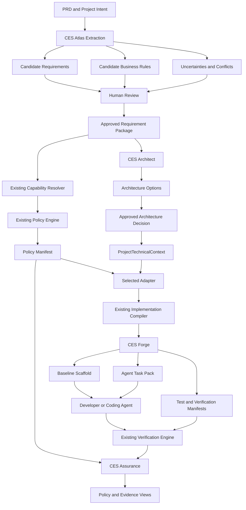

# CES Greenfield Product Suite Context

**Status:** Proposed product integration context  
**Repository:** `adityaa11/ces-platform`  
**Scope:** Greenfield projects first  
**Purpose:** Define four customer-facing CES end products that reuse the existing deterministic compiler, adapter, implementation-package, and verification foundations without weakening current architectural boundaries.

---

## 1. Executive Summary

The current CES repository is a strong deterministic engineering kernel:

```text
Structured Requirement
→ capabilities and traits
→ stack-agnostic Policy Manifest
→ selected adapter
→ implementation and verification package
```

The four end products defined in this document extend that kernel into a complete greenfield product experience:

1. **CES Atlas** — broad, documented requirements and system-intent graph.
2. **CES Architect** — requirement-aligned architecture and stack recommendation.
3. **CES Assurance** — security, quality, operational-policy, and evidence visibility.
4. **CES Forge** — baseline scaffold and agent-ready implementation package.

Together, they form one lifecycle:

```text
Natural-language PRD
        ↓
CES Atlas
        ↓
Approved Requirement Package and system-intent graph
        ↓
CES Architect
        ↓
Approved architecture and ProjectTechnicalContext
        ↓
Existing deterministic CES core
        ↓
Policy Manifest
        ↓
CES Assurance
        ↓
Visible obligations, risks, standards mappings, and evidence requirements
        ↓
Selected adapter
        ↓
CES Forge
        ↓
Baseline scaffold + agent-ready implementation package
        ↓
Developer or coding agent implements the application
        ↓
Existing verification engine
        ↓
CES Assurance updates implementation and evidence status
```

The four products are not four unrelated codebases. They are product views and orchestration layers over one shared CES knowledge model.

The current stack-agnostic core must remain deterministic and agent-neutral. AI may extract, classify, ask questions, and propose changes, but it must not silently alter approved requirements, resolved policies, adapter mappings, or verification obligations.

## 1.1 Execution status and approved delivery decisions

This document is the approved product direction for the greenfield suite. It is
implementation-ready only through the ticket plan in
[`tickets/greenfield/README.md`](tickets/greenfield/README.md). Tickets define
the delivery order and evidence required to claim completion.

The following execution decisions are approved:

1. Phase 0 local and hosted validation is a release gate for greenfield work.
2. Atlas is the first product milestone.
3. The existing single-requirement contract remains backward compatible. A
   separate versioned collection contract represents an approved set.
4. Requirements use persistent logical IDs. Content hashes identify immutable
   revisions and changes; editing content does not replace logical identity.
5. Architect scoring uses a deterministic, versioned rubric and human approval.
6. Laravel is the first Forge production target. Other stacks expose explicit
   adapter gaps until their adapters and scaffolds are implemented.
7. Assurance begins with traceability and evidence status. External standards
   packs follow later.
8. Packages are introduced incrementally when tickets prove distinct boundaries.
9. The project-management demonstration follows vocabulary generalization.
10. Agent functionality uses a provider-neutral interface, a deterministic
    fixture provider for CI, and one configurable real provider for interactive
    Atlas analysis.

---

## 2. Repository Baseline to Preserve

This proposal assumes and preserves the following existing CES boundaries.

### 2.1 Deterministic core boundary

The stack-agnostic core ends at the `Policy Manifest`.

```text
Requirement Package
+ Business Rules
+ ProjectAssuranceContext
+ Capability Registry
+ Policy Registry
→ Policy Manifest
```

The core must not import framework-specific implementation knowledge.

### 2.2 Adapter boundary

Adapters receive:

```text
Policy Manifest
+ ProjectTechnicalContext
→ stack-specific implementation and verification package
```

Adapters may explain how a selected stack can satisfy an obligation. They must not:

- add a mandatory policy that was not resolved by the core;
- remove or weaken a mandatory policy;
- reinterpret approved business rules;
- change requirement facts;
- cause the Policy Manifest to become framework-specific.

### 2.3 Agent boundary

An agent may:

- extract candidate requirements from documents;
- classify candidate business rules;
- identify uncertainty and contradiction;
- propose architecture options;
- propose registry additions;
- render agent-specific implementation instructions;
- assist semantic review.

An agent must not:

- write directly to stable registries;
- approve its own inferred requirement;
- silently select an architecture;
- change the meaning of a Policy Manifest;
- mark a policy as verified without evidence;
- claim certification or compliance based only on generated text.

### 2.4 Current phase alignment

The four products align with the current roadmap rather than replacing it:

| Existing phase direction | Product integration |
|---|---|
| Phase 1 deterministic compiler and adapter boundary | Shared kernel for all four products |
| Phase 2 integration and runner contracts | Stable orchestration and execution boundary |
| Phase 3 PRD and business-document extraction | CES Atlas foundation |
| Phase 4 adapter ecosystem, guidance, and scaffolding | CES Architect and CES Forge |
| Phase 5 governance, upgrades, exceptions, and impact analysis | Advanced CES Atlas and CES Assurance |

---

## 3. Product Suite Principles

### 3.1 Greenfield-first

The first commercial and technical MVP targets new applications.

CES establishes the system of record before implementation begins:

```text
Initial PRD
→ approved requirements
→ approved business rules
→ architecture decision
→ policies
→ implementation tasks
→ verification evidence
```

Brownfield reconstruction is explicitly deferred. The model must remain extendable to brownfield use, but the MVP must not require historical-PRD archaeology.

### 3.2 One shared source of truth

The four products must not independently generate contradictory representations.

They share:

- Requirement Package;
- Business Rule records;
- project facts and uncertainties;
- capability and trait resolution;
- policy obligations;
- architecture decisions;
- adapter selection;
- implementation tasks;
- verification evidence;
- stable identifiers and version metadata.

### 3.3 Proposed, approved, and derived data are distinct

Every important artifact must indicate whether it is:

- **explicit** — directly supported by an input source;
- **inferred** — proposed by an extraction or classification agent;
- **confirmed** — approved by an authorized user;
- **derived** — deterministically produced from approved inputs;
- **observed** — discovered through repository or runtime evidence.

An inference is never automatically equivalent to approved project truth.

### 3.4 Progressive confidence

CES should provide useful output even when some questions remain unresolved, but it must visibly reduce confidence and block decisions that depend on missing facts.

Possible states:

```text
candidate
→ needs_confirmation
→ approved
→ superseded
→ rejected
```

### 3.5 Product views do not change policy meaning

Atlas, Architect, Assurance, and Forge may render the same data differently for different users. Presentation must not alter the underlying contracts.

---

## 4. Shared Greenfield Lifecycle



---

# 5. Product One — CES Atlas

## 5.1 Product statement

> **CES Atlas converts a greenfield PRD into a broad, traceable system-intent graph that shows what the planned application should do, how requirements relate, where rules conflict, and which decisions remain unresolved.**

## 5.2 Primary users

- Product managers;
- business analysts;
- technical founders;
- solution architects;
- lead developers;
- software agencies;
- coding agents consuming approved context.

## 5.3 Customer problem

A new application often begins with fragmented intent:

- PRD sections;
- user stories;
- acceptance criteria;
- diagrams;
- chat decisions;
- assumptions;
- role descriptions;
- security expectations;
- non-functional requirements.

Developers or coding agents may implement the visible feature while missing:

- cross-feature dependencies;
- implicit authorization;
- state-transition restrictions;
- tenant ownership;
- audit requirements;
- failure behavior;
- conflicting rules;
- undefined edge cases.

Atlas creates one approved model before the project fragments into many tickets and code paths.

## 5.4 MVP responsibilities

Atlas must:

1. ingest one or more Markdown PRDs;
2. retain source location and content hashes;
3. extract candidate requirements;
4. extract candidate business rules;
5. classify actors, actions, resources, states, and data;
6. identify duplicate or overlapping requirements;
7. identify contradictions and unresolved facts;
8. generate targeted clarification questions;
9. allow user approval, rejection, or correction;
10. produce an approved Requirement Package compatible with the existing deterministic core;
11. render a requirements/system-intent graph;
12. produce machine-readable and human-readable outputs.

## 5.5 MVP non-responsibilities

Atlas does not initially:

- reconstruct an existing production system;
- ingest every historical PRD;
- inspect runtime behavior;
- decide the final technology stack;
- resolve policies;
- generate implementation code;
- approve agent inferences automatically;
- provide legal or certification conclusions.

## 5.6 Proposed inputs

```text
docs/prd.md
.ces/project-intent.yaml
optional supporting Markdown documents
optional explicit user answers
```

Example `project-intent.yaml`:

```yaml
schema_version: "1.0.0"

project:
  id: project-management-saas
  lifecycle: greenfield
  application_type: transactional_web_application
  business_domain: project_management

delivery:
  team_size: 2
  expected_delivery_months: 3
  deployment_preference: managed_cloud

constraints:
  expected_users: 1000
  data_sensitivity: internal
  multi_tenant: true

skills:
  preferred_languages:
    - typescript
  preferred_database:
    - postgresql
```

## 5.7 Proposed outputs

```text
.ces/generated/atlas/
├── source-index.json
├── candidate-requirements.json
├── candidate-business-rules.json
├── uncertainties.json
├── conflicts.json
├── clarification-questions.md
├── review-decisions.json
├── requirement-package.json
├── system-intent-graph.json
├── system-intent-graph.md
└── extraction-report.json
```

## 5.8 Required new contracts

### SourceReference

```yaml
document_id: PRD-MAIN
path: docs/prd.md
section: "4.2 Project Management"
line_start: 120
line_end: 138
content_hash: sha256:...
```

### InferenceMetadata

```yaml
origin: inferred
confidence: 0.87
agent:
  provider: configured-provider
  model: configured-model
  prompt_contract_version: "1.0.0"
review:
  status: needs_confirmation
```

### RequirementLink

```yaml
source_id: REQ-014
target_id: REQ-003
relationship: depends_on
reason: Project assignment requires an existing project.
```

Initial relationship vocabulary:

- `depends_on`
- `refines`
- `supersedes`
- `conflicts_with`
- `duplicates`
- `affects`
- `constrains`
- `implements`
- `verified_by`

## 5.9 Proposed packages

```text
packages/
├── source-document-schema
├── project-intent-schema
├── extraction-contracts
├── document-ingestion
├── requirement-extractor
├── business-rule-classifier
├── clarification-engine
├── requirement-review
├── system-intent-graph
└── agent-provider-sdk
```

The existing `requirement-schema` and `business-rule-schema` remain authoritative for approved core inputs. Extraction-specific metadata should either:

- extend them through versioned optional fields; or
- exist in separate candidate schemas that compile into approved core schemas.

The preferred design is a separate candidate boundary so the deterministic core never consumes unreviewed agent output.

Atlas also requires a versioned `RequirementCollection` envelope. It references
multiple individually valid approved Requirement Packages and records collection
identity, ordering, and revision hashes without replacing the existing
single-requirement contract.

The current Phase 1 controlled vocabulary is limited to the profile-picture
regression fixture. Atlas cannot claim the project-management demonstration
complete until actors, operations, resources, states, and relationships are
generalized through versioned vocabularies with backward-compatibility tests.

Agent execution is isolated behind `agent-provider-sdk`. CI and deterministic
contract tests use a fixture provider. Interactive analysis may use a configured
real provider, but its candidate output remains non-deterministic and unapproved
until reviewed. Approved normalized artifacts, not raw model execution, form
the deterministic boundary.

## 5.10 Proposed CLI

```bash
ces atlas analyze \
  --prd docs/prd.md \
  --project-intent .ces/project-intent.yaml \
  --output .ces/generated/atlas

ces atlas questions \
  --analysis .ces/generated/atlas \
  --output .ces/generated/atlas/clarification-questions.md

ces atlas approve \
  --analysis .ces/generated/atlas \
  --decisions .ces/reviews/atlas-review.yaml

ces atlas graph \
  --requirement-package .ces/generated/atlas/requirement-package.json
```

## 5.11 Diagram requirements

Atlas should support at least these views:

1. **Requirement hierarchy**
2. **Actor-action-resource graph**
3. **Business-rule classification**
4. **Feature dependency graph**
5. **Conflict and uncertainty view**
6. **Requirement-to-capability traceability**
7. **Requirement-to-task traceability after Forge generation**

For the CLI MVP, JSON, Markdown, and Mermaid output are enough. A web visualization is optional and should not block the pipeline.

## 5.12 Definition of done

Atlas MVP is complete when:

- a realistic greenfield PRD is converted into candidate artifacts;
- every candidate has provenance;
- explicit and inferred facts are visibly separated;
- unresolved high-impact questions are produced;
- user decisions generate an approved Requirement Package;
- the approved package can enter the existing capability and policy pipeline unchanged;
- a requirements graph is generated with stable identifiers;
- repeated runs with the same approved inputs produce deterministic approved artifacts.

---

# 6. Product Two — CES Architect

## 6.1 Product statement

> **CES Architect recommends an architecture style and candidate stack based on approved requirements, project constraints, team capability, operational expectations, and resolved engineering needs.**

## 6.2 Primary users

- Technical founders;
- software agencies;
- solution architects;
- tech leads;
- pre-sales engineers;
- developers starting an AI-assisted project.

## 6.3 Customer problem

Stack selection is often driven by:

- familiarity;
- trends;
- one developer's preference;
- template availability;
- agent suggestions without project context.

A useful recommendation must explain:

- which requirements drove the decision;
- which capabilities must be supported;
- operational cost;
- consistency and transaction needs;
- scaling assumptions;
- team constraints;
- rejected alternatives;
- conditions that would invalidate the recommendation.

## 6.4 Architectural boundary

Architect operates **before adapter selection**.

It does not change the Policy Manifest. It produces an approved `ArchitectureDecision` and `ProjectTechnicalContext` that the existing adapter stage consumes.

```text
Approved Requirement Package
+ ProjectIntent
+ resolved capabilities
+ project constraints
→ architecture candidates
→ human approval
→ ProjectTechnicalContext
→ existing adapter resolution
```

## 6.5 MVP responsibilities

Architect must:

1. derive system characteristics from approved requirements;
2. combine characteristics with explicit project constraints;
3. generate one recommended architecture and up to two alternatives;
4. provide requirement-linked rationale;
5. identify trade-offs and operational burden;
6. list rejected approaches with reasons;
7. identify adapter availability and gaps;
8. require human approval before technical context is finalized;
9. generate an Architecture Decision Record;
10. generate a valid `ProjectTechnicalContext`.

## 6.6 MVP non-responsibilities

Architect does not:

- select a stack only from popularity;
- silently override team or infrastructure constraints;
- guarantee performance without measurable assumptions;
- treat a vendor recommendation as a policy requirement;
- add or remove security policies;
- build the application;
- claim that one stack is universally best.

## 6.7 Initial supported recommendation scope

The first MVP should recommend within a controlled catalog.

### Architecture styles

- modular monolith;
- layered monolith;
- service-oriented modular application;
- microservices only when explicit conditions justify them.

### Initial stack catalog

A small catalog is preferred:

- Laravel + PostgreSQL;
- Next.js/TypeScript + PostgreSQL/Supabase;
- Spring Boot + PostgreSQL;
- Go + PostgreSQL.

The repository may continue using Laravel as the first proven adapter. The recommendation engine must not assume that Laravel is the default answer.

## 6.8 Proposed outputs

```text
.ces/generated/architect/
├── system-characteristics.json
├── architecture-candidates.json
├── architecture-comparison.md
├── adapter-availability.json
├── decision-questions.md
├── architecture-decision.json
├── architecture-decision.md
└── project-technical-context.yaml
```

## 6.9 Proposed contracts

### SystemCharacteristic

```yaml
id: CHARACTERISTIC-TRANSACTIONAL-CONSISTENCY
value: strong
source_requirement_ids:
  - REQ-021
  - REQ-022
confidence: 0.96
status: confirmed
```

### ArchitectureCandidate

```yaml
id: modular-monolith-nextjs-postgresql

architecture_style: modular_monolith

technology:
  language: typescript
  framework: nextjs
  database: postgresql
  provider: supabase

suitability:
  score: 0.86

reasons:
  - source_requirement_ids: [REQ-003, REQ-014]
    statement: Multi-tenant application needs relational ownership and constraints.
  - project_constraint_ids: [CONSTRAINT-TEAM-001]
    statement: Small team benefits from one deployable unit.

risks:
  - statement: Server and frontend concerns require strict module boundaries.
    mitigation: Enforce server-only package boundaries and adapter verification.

adapter:
  id: nextjs-supabase
  support_level: unavailable
  gap: Production adapter not yet implemented.
```

### ArchitectureDecision

```yaml
schema_version: "1.0.0"
decision_id: ADR-001
status: approved
selected_candidate_id: modular-monolith-nextjs-postgresql
approved_by: project_owner
approved_source_hash: sha256:...
rejected_candidates:
  - candidate_id: microservices-spring
    reason: Operational overhead is not justified for the team and scale.
revisit_conditions:
  - Independent scaling of three or more modules becomes necessary.
  - Separate release ownership is established.
```

## 6.10 Proposed packages

```text
packages/
├── architecture-decision-schema
├── system-characteristic-resolver
├── technology-catalog
├── architecture-planner
├── architecture-review
└── adapter-compatibility
```

`technology-catalog` must be versioned and descriptive. It must not be embedded in the policy engine.

Candidate suitability scores must be calculated by a versioned deterministic
rubric. Every score exposes its factors, weights, source facts, catalog version,
and blocked inputs. Agent prose may explain a score but must not calculate or
silently alter it.

`project-technical-context.yaml` contains exactly the existing
`ProjectTechnicalContext` fragment. A separate composition step combines it
with project identity, assurance context, CES baseline, and approved adapter
selection to produce the existing complete `ProjectContext`.

## 6.11 Proposed CLI

```bash
ces architect analyze \
  --requirement-package .ces/generated/atlas/requirement-package.json \
  --project-intent .ces/project-intent.yaml

ces architect compare \
  --analysis .ces/generated/architect/system-characteristics.json

ces architect approve \
  --candidate modular-monolith-nextjs-postgresql \
  --decisions .ces/reviews/architecture-review.yaml

ces architect emit-context \
  --decision .ces/generated/architect/architecture-decision.json
```

## 6.12 Definition of done

Architect MVP is complete when:

- approved requirements produce traceable system characteristics;
- one recommendation and meaningful alternatives are generated;
- recommendations respect project constraints;
- adapter support and gaps are explicit;
- a user-approved Architecture Decision is generated;
- a valid `ProjectTechnicalContext` enters the existing adapter pipeline;
- changing technical preferences does not change the stack-agnostic Policy Manifest.

---

# 7. Product Three — CES Assurance

## 7.1 Product statement

> **CES Assurance makes security, quality, operational, privacy, and delivery obligations visible from requirement through implementation and verification evidence.**

## 7.2 Primary users

- Developers;
- tech leads;
- AppSec;
- engineering managers;
- software agencies;
- clients reviewing delivery quality;
- auditors and governance teams in later phases.

## 7.3 Customer problem

Policies frequently exist as disconnected documents and scanner findings.

Teams struggle to answer:

- Why does this policy apply?
- Which requirement triggered it?
- Is it mandatory, conditional, prohibited, or blocked?
- How should the selected stack implement it?
- What evidence is required?
- Has it been implemented?
- Was an exception approved?
- Which external standard does it relate to?

Assurance turns the existing Policy Manifest and verification outputs into an understandable product view.

## 7.4 Architectural boundary

Assurance does not decide policies independently.

Its authoritative inputs are:

- approved Requirement Package;
- resolved Policy Manifest;
- adapter implementation package;
- verification results;
- versioned standards mappings;
- later governance and exception records.

## 7.5 MVP responsibilities

Assurance must:

1. render each policy obligation and its triggering reason;
2. connect obligations to source requirements and business rules;
3. show requirement level and resolution state;
4. show adapter support and implementation guidance;
5. show required tests and evidence;
6. show verification state;
7. distinguish automated verification from human review;
8. show blocked, unsupported, missing, and partial obligations;
9. generate developer and management summaries;
10. support versioned external-standard references without changing CES policy meaning.

The first Assurance milestone is limited to traceability, obligation status,
required evidence, supplied evidence, and verification-result views. External
standards packs, semantic-review automation, exception governance, and
certification-oriented reporting are later increments and do not block it.

## 7.6 MVP policy views

### Developer view

- policy statement;
- source requirements;
- implementation guidance;
- prohibited shortcuts;
- required tests;
- evidence markers;
- verification status.

### Architecture/security view

- capability coverage;
- policy graph;
- adapter support;
- unresolved obligations;
- high-severity gaps;
- semantic-review requirements.

### Delivery/client view

- verified controls;
- partial controls;
- missing controls;
- human-review items;
- declared limitations;
- no certification claim.

## 7.7 Proposed outputs

```text
.ces/generated/assurance/
├── obligation-traceability.json
├── policy-catalog.md
├── policy-graph.json
├── policy-graph.md
├── adapter-support-matrix.json
├── evidence-requirements.json
├── verification-summary.json
├── developer-assurance-report.md
├── management-assurance-report.md
└── standards-mapping-report.md
```

## 7.8 Standards-pack boundary

External standards must be mapped through independent, versioned packs.

```text
CES Policy Registry
        ↓
stable CES policy IDs and meanings

Standards Pack
        ↓
versioned references from CES policy IDs
to external standard controls
```

Example:

```yaml
schema_version: "1.0.0"
pack:
  id: owasp-web
  version: "2026.07"

sources:
  - standard: OWASP_ASVS
    version: "5.0.0"
  - standard: OWASP_TOP_10
    version: "2025"

mappings:
  - policy_id: RESOURCE_LEVEL_AUTHORIZATION
    references:
      - standard: OWASP_ASVS
        version: "5.0.0"
        control_id: "version-qualified-control-id"
        mapping_status: reviewed
```

Rules:

- a standards update must create a new pack version;
- an old CES run remains reproducible with its pinned pack;
- an agent may propose mapping changes;
- only reviewed mappings enter a stable pack;
- standards mappings provide traceability, not certification;
- “latest OWASP” must never be stored as an unversioned requirement.

## 7.9 Proposed packages

```text
packages/
├── assurance-schema
├── assurance-view-model
├── traceability-engine
├── evidence-schema
├── standards-pack-schema
├── standards-mapper
├── assurance-reporting
└── semantic-review-contracts
```

The existing `verification-engine` remains authoritative for verification execution. Assurance consumes its results and renders them.

## 7.10 Proposed CLI

```bash
ces assurance build \
  --requirement-package .ces/generated/atlas/requirement-package.json \
  --policy-manifest .ces/generated/core/policy-manifest.json \
  --implementation-package .ces/generated/adapters/<adapter> \
  --standards-pack owasp-web@2026.07

ces assurance report \
  --audience developer

ces assurance report \
  --audience management

ces assurance status
```

## 7.11 Suggested status vocabulary

At obligation level:

- `resolved`
- `blocked`
- `conflict`
- `adapter_gap`

At implementation/evidence level:

- `not_started`
- `implemented_unverified`
- `partial`
- `verified`
- `failed`
- `human_review_required`
- `unsupported`
- `not_applicable`

The product must not collapse these into one score without preserving the underlying states.

## 7.12 Definition of done

Assurance MVP is complete when:

- every Policy Manifest obligation traces to its reasons;
- adapter support is visible;
- required implementation and test evidence is visible;
- verification results update the same policy view;
- a developer report and management report are generated;
- reports clearly avoid certification claims.

The first end-to-end greenfield demonstration requires Assurance traceability
and evidence-state visibility. It does not require an external standards pack.
Standards packs enrich policy visibility only after the core
requirement-to-evidence lifecycle is proven.

---

# 8. Product Four — CES Forge

## 8.1 Product statement

> **CES Forge converts approved requirements, architecture decisions, and policy obligations into a controlled project baseline and agent-ready implementation package. CES defines the contract; a developer or coding agent performs the end implementation.**

## 8.2 Primary users

- Developers using Codex, Claude Code, Copilot, or another agent;
- small agencies;
- solo developers handling several projects;
- teams wanting repeatable project foundations;
- CI systems verifying generated implementation obligations.

## 8.3 Customer problem

Coding agents work better when they receive:

- explicit business rules;
- architecture boundaries;
- permission and tenancy rules;
- prohibited shortcuts;
- acceptance criteria;
- required tests;
- stable interfaces;
- traceable task scope.

A generic prompt such as “build project management SaaS” encourages the agent to invent missing decisions.

Forge must provide the approved implementation boundary without pretending to implement the whole business application.

## 8.4 Relationship to existing implementation compiler

The current implementation compiler already produces:

- implementation plan;
- implementation task;
- test manifest;
- verification manifest.

Forge should extend and productize this output. It should not replace the current contracts casually.

Suggested model:

```text
Existing Implementation Package
        ↓
Forge rendering and scaffold layer
        ↓
baseline scaffold
+ feature task packs
+ agent-specific presentation
+ verification harness
```

## 8.5 MVP responsibilities

Forge must:

1. consume an approved Requirement Package;
2. consume an approved Architecture Decision and `ProjectTechnicalContext`;
3. consume the Policy Manifest;
4. consume the selected adapter mapping;
5. produce a baseline project scaffold;
6. produce feature-level implementation tasks;
7. produce acceptance criteria and required tests;
8. produce agent-neutral constraints;
9. optionally render agent-specific instruction formats;
10. preserve traceability IDs in generated artifacts;
11. avoid overwriting user-owned code without an explicit safe update contract;
12. generate verification manifests consumable by the existing verification engine.

## 8.6 MVP non-responsibilities

Forge does not:

- build the complete application automatically;
- choose or change business rules;
- change the Policy Manifest;
- approve an architecture;
- silently regenerate and overwrite edited code;
- claim semantic correctness without verification;
- become coupled to one coding agent.

## 8.7 Baseline scaffold scope

The scaffold may generate:

- workspace and module structure;
- shared authentication boundary;
- authorization interfaces;
- tenant-context abstraction;
- validation conventions;
- error contracts;
- audit-event interfaces;
- database migration foundation;
- test harness and fixtures;
- CI workflow;
- CES metadata and evidence hooks;
- adapter-specific safe defaults.

The scaffold should not generate every CRUD use case or all domain behavior.

## 8.8 Agent-neutral task contract

Each task should include:

```markdown
# TASK-<ID>: <Title>

## Objective

## Source Requirements

## Approved Business Rules

## Applicable Policy Obligations

## Architecture Constraints

## Required Interfaces

## Acceptance Criteria

## Required Tests

## Required Evidence

## Prohibited Shortcuts

## Dependencies

## Out of Scope

## Unresolved Decisions

## Completion Conditions
```

Example prohibited shortcuts:

- do not trust tenant or organization IDs supplied by the client;
- do not enforce authorization only through hidden interface controls;
- do not bypass the selected validation boundary;
- do not weaken database constraints to simplify implementation;
- do not mark the task complete without required tests;
- do not modify out-of-scope state transitions.

## 8.9 Agent-specific renderers

Optional renderers may generate:

```text
AGENTS.md
.codex/instructions.md
.claude/commands/...
.github/copilot-instructions.md
```

They must all derive from the same agent-neutral Implementation Package.

Selecting a coding agent changes presentation only. It must not change:

- requirement facts;
- policy obligations;
- adapter mappings;
- required tests;
- verification requirements.

## 8.10 Proposed outputs

```text
.ces/generated/forge/
├── baseline/
│   ├── manifest.json
│   └── generated project files
├── tasks/
│   ├── task-index.json
│   ├── TASK-001.md
│   └── TASK-002.md
├── agents/
│   ├── neutral/
│   ├── codex/
│   └── claude/
├── tests/
│   ├── acceptance-manifest.json
│   └── policy-test-manifest.json
├── verification/
│   └── verification-manifest.json
└── forge-report.json
```

## 8.11 Proposed packages

```text
packages/
├── task-contracts
├── task-planner
├── scaffold-contracts
├── scaffold-generator
├── agent-renderer-sdk
├── agent-renderer-neutral
├── agent-renderer-codex
├── agent-renderer-claude
└── generation-safety
```

Stack-specific scaffold templates belong to adapter packages or adapter-owned components, not the stack-agnostic core.

Possible adapter layout:

```text
adapters/
└── laravel/
    ├── mappings/
    ├── guidance/
    ├── verification/
    ├── scaffold/
    └── fixtures/
```

## 8.12 Generation safety

Forge requires explicit ownership rules.

Each generated file must be classified as:

- `generated_replaceable`
- `generated_mergeable`
- `user_owned`
- `generated_once`

A manifest should record:

```yaml
path: src/platform/authorization/index.ts
ownership: generated_once
template_hash: sha256:...
generated_by:
  adapter_id: laravel
  adapter_version: "0.1.0"
  scaffold_version: "0.1.0"
```

Forge must fail safely when regeneration would overwrite user-owned modifications without an approved migration plan.

## 8.13 Proposed CLI

```bash
ces forge plan \
  --requirement-package .ces/generated/atlas/requirement-package.json \
  --architecture .ces/generated/architect/architecture-decision.json \
  --policy-manifest .ces/generated/core/policy-manifest.json

ces forge scaffold \
  --adapter laravel \
  --output .

ces forge tasks \
  --renderer neutral

ces forge tasks \
  --renderer codex

ces forge verify-generation
```

## 8.14 Definition of done

Forge MVP is complete when:

- one approved greenfield project produces a safe baseline scaffold;
- tasks trace to requirements, business rules, and policies;
- agent-neutral and one agent-specific renderer produce equivalent obligations;
- required tests and evidence are generated;
- the coding agent can implement at least one feature from the generated task;
- the existing verification engine evaluates the implementation;
- generation does not silently overwrite user-owned code;
- changing the renderer does not change the core implementation contract.

---

# 9. Shared Data and Traceability Model

The four products require one stable identity chain.

```text
Source Document
→ Requirement
→ Business Rule
→ Capability/Trait
→ Policy Obligation
→ Architecture Decision
→ Adapter Mapping
→ Implementation Task
→ Test Obligation
→ Evidence
→ Verification Result
```

Minimum traceability record:

```yaml
trace_id: TRACE-001
source_document_ids:
  - PRD-MAIN
requirement_ids:
  - REQ-014
business_rule_ids:
  - BR-021
capability_ids:
  - TENANT_ISOLATION
policy_ids:
  - RESOURCE_LEVEL_AUTHORIZATION
architecture_decision_ids:
  - ADR-001
task_ids:
  - TASK-008
test_ids:
  - TEST-022
evidence_ids:
  - EVIDENCE-041
verification_result_ids:
  - VERIFY-041
```

Logical record IDs must remain stable across edits. Content-derived hashes
identify immutable artifact revisions, normalized collections, registry
contents, and compilation inputs; they must not be used as the only logical
identity for a requirement that can be corrected or superseded.

---

# 10. Proposed Repository Integration

## 10.1 Preserve existing packages

Do not move or rewrite the existing deterministic kernel merely to match product names.

Keep:

```text
packages/
├── requirement-schema
├── business-rule-schema
├── project-schema
├── capability-registry
├── capability-resolver
├── policy-registry
├── policy-engine
├── policy-manifest
├── adapter-sdk
├── implementation-compiler
├── verification-engine
├── integration-contracts
└── bootstrap-runner
```

## 10.2 Add product-facing packages around the kernel

Recommended target structure:

```text
packages/
├── [existing deterministic kernel packages]
│
├── source-document-schema
├── project-intent-schema
├── extraction-contracts
├── document-ingestion
├── requirement-extractor
├── business-rule-classifier
├── clarification-engine
├── requirement-review
├── system-intent-graph
│
├── architecture-decision-schema
├── system-characteristic-resolver
├── technology-catalog
├── architecture-planner
├── architecture-review
├── adapter-compatibility
│
├── assurance-schema
├── traceability-engine
├── evidence-schema
├── standards-pack-schema
├── standards-mapper
├── assurance-reporting
├── semantic-review-contracts
│
├── task-contracts
├── task-planner
├── scaffold-contracts
├── scaffold-generator
├── agent-provider-sdk
├── agent-renderer-sdk
└── generation-safety
```

## 10.3 Apps and orchestration

Recommended:

```text
apps/
├── cli
└── api                 # optional after CLI MVP

products/               # optional presentation/orchestration packages
├── atlas
├── architect
├── assurance
└── forge
```

A `products/` directory is optional. The product names can initially be CLI namespaces without creating new deployment units.

## 10.4 Recommended CLI shape

```bash
ces atlas ...
ces architect ...
ces core ...
ces assurance ...
ces forge ...
ces verify ...
```

Existing commands should remain available for backward compatibility:

```bash
ces validate-requirement
ces resolve-policy
ces compile-adapter
ces compile
ces verify
```

Product commands may orchestrate existing commands but must not duplicate their internal logic.

---

# 11. Output Layout

Recommended greenfield project footprint:

```text
.ces/
├── project-intent.yaml
├── project.yaml
├── ces.lock
│
├── sources/
│   ├── prd.md
│   └── supporting/
│
├── reviews/
│   ├── atlas-review.yaml
│   ├── architecture-review.yaml
│   └── assurance-exceptions.yaml
│
├── requirements/
│   ├── requirement-collection.json
│   └── packages/
│       ├── REQ-001.json
│       ├── REQ-002.json
│       └── REQ-003.json
│
├── generated/
│   ├── atlas/
│   ├── architect/
│   ├── core/
│   ├── assurance/
│   ├── adapters/
│   └── forge/
│
└── standards/
    └── lock.yaml
```

`.ces-runtime/` remains temporary runner state.

`requirement-collection.json` records the collection schema version, persistent
collection ID, immutable collection revision hash, normalized ordering, and
approval metadata. Each entry references a Requirement Package by persistent
logical ID and immutable revision hash; it does not redefine package content.

---

# 12. Phase Integration Roadmap

## Phase 0 — Preserve and baseline current work

Before product expansion:

- complete current Phase 1 and Phase 2 validation locally and in hosted CI;
- resolve the bootstrap-runner timeout and process-tree regression tests;
- freeze versioned core contracts;
- document backward-compatibility expectations;
- tag an initial baseline;
- retain the existing profile-picture fixture as a deterministic regression scenario.

No greenfield package or feature implementation may begin while this gate is
open. Permitted work is limited to documentation and ticket refinement,
investigation and design validation, Phase 1 and Phase 2 baseline corrections,
local and hosted validation, and contract inventory or compatibility analysis.
`CES-GF-FND-002` and every product implementation ticket depend on acceptance
of `CES-GF-FND-001`.

## Phase 3A — Atlas candidate extraction

Deliver:

- Markdown ingestion;
- source references;
- candidate Requirement IR;
- candidate Business Rule IR;
- uncertainty and conflict outputs;
- schema-constrained agent provider boundary.

Do not connect unreviewed candidates directly to the policy engine.

## Phase 3B — Atlas review and graph

Deliver:

- clarification workflow;
- approval records;
- approved Requirement Package generation;
- requirement relationship graph;
- Mermaid/Markdown visualization;
- end-to-end path into the existing deterministic core.

This is the first greenfield product milestone.

## Phase 4A — Architect

Deliver:

- `ProjectIntent`;
- system characteristic resolution;
- architecture candidate catalog;
- Architecture Decision Record;
- human approval;
- `ProjectTechnicalContext` emission;
- adapter availability report.

## Phase 4B — Forge implementation contract

Deliver:

- feature task planning;
- richer task schema;
- acceptance criteria;
- agent-neutral renderer;
- one coding-agent renderer;
- integration with existing implementation and verification manifests.

## Phase 4C — Forge baseline scaffold

Deliver:

- one production stack scaffold;
- file ownership manifest;
- safe generation and regeneration;
- fixture projects;
- positive and negative adapter tests.

## Phase 5A — Traceability and evidence contracts

Deliver:

- traceability report;
- policy graph;
- evidence requirements and evidence status.

## Phase 5B — Assurance views

Deliver:

- developer and management views;
- verification-result integration;
- explicit automated and human-review states.

The first end-to-end greenfield demonstration depends on Phase 5A and Phase 5B.
It does not depend on a standards pack.

## Phase 5C — Versioned standards packs

Deliver:

- first versioned standards pack.

## Phase 5D — Advanced governance

Later:

- semantic-review contract and controlled semantic-review integration;
- approved exceptions;
- policy overrides with governance;
- organization registries;
- standards-pack migrations;
- upgrade impact;
- change-impact analysis;
- brownfield incremental discovery.

---

# 13. Recommended First Demonstration

Use one greenfield multi-tenant project-management application.

## 13.1 Core domain

- Company
- User
- Membership
- Project
- Task
- Task assignment
- Invitation
- Notification
- Audit event

## 13.2 Required behavior

- authenticated access;
- company-scoped resources;
- multiple roles;
- server-side authorization;
- tenant isolation;
- project and task state transitions;
- archival behavior;
- assignment rules;
- notification behavior;
- auditability;
- validation;
- uniqueness constraints;
- integration and policy tests.

## 13.3 Demonstration success path

```text
PRD
→ Atlas extraction
→ user clarification
→ approved Requirement Package
→ Architect recommendation
→ approved technical context
→ deterministic Policy Manifest
→ Assurance policy visibility
→ selected adapter
→ Forge scaffold and tasks
→ coding-agent implementation
→ verification
→ updated Assurance report
```

This demonstration should prove that the four end products are one connected lifecycle, not separate report generators.

---

# 14. Cross-Product Acceptance Criteria

The integrated product suite is successful only when all of the following are true.

## 14.1 Traceability

Every generated policy, task, test, and evidence requirement can trace back to an approved requirement or deterministic project fact.

## 14.2 Determinism

After human approval, identical normalized inputs and pinned versions produce identical deterministic artifacts.

Agent execution metadata must not contaminate deterministic core outputs.

## 14.3 Boundary integrity

- Atlas cannot directly change policies.
- Architect cannot change requirement facts.
- Assurance cannot create verification evidence.
- Forge cannot alter the Policy Manifest.
- Adapters cannot weaken obligations.
- Agent renderers cannot change task meaning.

## 14.4 Honest uncertainty

Missing facts, agent inference, adapter gaps, unsupported verification, and human-review requirements remain explicit.

## 14.5 Greenfield usability

A user should be able to start with:

```text
one PRD
+ one small project-intent file
```

and receive useful output without manually authoring every CES intermediate representation.

## 14.6 Agent usefulness

The implementation package should contain enough context that a coding agent does not need to invent:

- ownership rules;
- role permissions;
- state restrictions;
- policy obligations;
- acceptance criteria;
- test expectations.

## 14.7 Verification closure

The lifecycle does not end at task generation. CES must evaluate the produced implementation and connect verification results back to the same obligations.

---

# 15. Explicit MVP Non-Goals

The first greenfield suite will not provide:

- full brownfield system reconstruction;
- arbitrary PDF/OCR ingestion;
- autonomous stable-registry writes;
- automatic certification;
- universal stack support;
- automatic microservice design;
- complete code generation;
- production runtime enforcement;
- unsupervised architecture selection;
- unsupervised standards upgrades;
- perfect semantic code verification;
- a large enterprise dashboard;
- Jira, Confluence, GitLab, and Azure DevOps integration;
- a policy or adapter marketplace.

These may be future capabilities, but none should block the first end-to-end greenfield workflow.

---

# 16. Product Naming

The names in this document are working names.

| Product | Working purpose |
|---|---|
| CES Atlas | Requirement and system-intent map |
| CES Architect | Architecture and stack recommendation |
| CES Assurance | Policy, standards, evidence, and verification visibility |
| CES Forge | Baseline scaffold and agent-ready implementation package |

The repository and internal contracts should remain named by responsibility rather than commercial branding. Product names belong primarily in orchestration, documentation, CLI namespaces, and future UI surfaces.

---

# 17. Final Product Position

The integrated CES product can be described as:

> **CES is a greenfield engineering assurance platform that converts a PRD into an approved system-intent graph, recommends a requirement-aligned architecture, resolves visible security and engineering obligations, and generates a controlled baseline and implementation contract for developers or coding agents. CES does not replace the implementer; it defines and verifies the boundaries within which implementation occurs.**

Condensed lifecycle:

```text
Understand
→ Decide
→ Govern
→ Hand off
→ Verify
```

Mapped to products:

```text
CES Atlas
→ CES Architect
→ CES Assurance
→ CES Forge
→ CES Verification
```

The current deterministic compiler, adapter boundary, implementation compiler, bootstrap runner, and verification engine remain the foundation underneath this suite.
