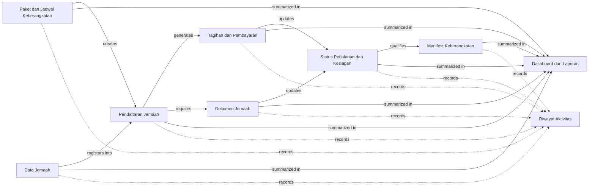

# Atlas Workspace Layout

## Design Philosophy

Atlas is **not** a graph viewer.

Atlas is a **knowledge explorer** where the Main Workflow acts as the permanent navigation map for the entire project.

The Main Workflow should **always remain visible** regardless of what the user is currently inspecting.

The lower section changes dynamically according to the selected node from the Main Workflow or any nested child node.

---

# Workspace Layout

```
+========================================================================================================+
| Project identity | Lifecycle | Authority | Execution | Revision                                        |
+==============================+===================================================+=====================+
| Semantic Areas               | PROJECT MAP                                       | PDF Evidence        |
|                              |                                                   |                     |
| • Package                    |  +---------------------------------------------+  | PDF                 |
| • Registration               |  |                                             |  | Section             |
| • Payment                    |  |             MAIN WORKFLOW                    |  | Page                |
| • Documents                  |  |                                             |  | Paragraph           |
| • Readiness                  |  |          Interactive Graph                  |  | Original Text       |
| • Manifest                   |  |                                             |  |                     |
| • Reports                    |  +---------------------------------------------+  |                     |
| • Audit                      |                                                   |                     |
+==============================+===================================================+=====================+
| Breadcrumb                                                                                             |
| Main Workflow                                                                                           |
+========================================================================================================+
| Dynamic Detail Section                                                                                  |
|                                                                                                         |
| Changes according to selected workflow/module.                                                          |
+========================================================================================================+
```

---

# Main Workflow

The Main Workflow is the primary navigation graph.

It is **always pinned** at the top-center of the workspace.

It is **never replaced** when navigating deeper.

The graph is interactive.

Selecting a node expands the Detail Section below.

Example:



---

# Interaction Model

The Main Workflow is the navigation entry point.

Example:

```
User clicks

Tagihan dan Pembayaran
```

The Detail Section becomes

```
Tagihan dan Pembayaran

Workflow

Payment State Machine

Billing State Machine

Business Rules

Validations

Permissions

Evidence
```

The Main Workflow above **does not change**.

---

# Breadcrumb

Every navigation updates the breadcrumb.

Example

```
Main Workflow
>
Tagihan dan Pembayaran
```

Click

```
Workflow
```

Breadcrumb becomes

```
Main Workflow
>
Tagihan dan Pembayaran
>
Workflow
```

Click

```
Payment State Machine
```

Breadcrumb becomes

```
Main Workflow
>
Tagihan dan Pembayaran
>
Payment State Machine
```

---

# Recursive Navigation

Any detail node may contain additional child nodes.

Example

```
Main Workflow

└── Tagihan dan Pembayaran

    ├── Workflow

    ├── Payment State Machine

    ├── Billing State Machine

    ├── Business Rules

    ├── Validations

    ├── Permissions

    └── Evidence
```

If a child contains another module, continue recursively.

Example

```
Main Workflow

└── Status Perjalanan dan Kesiapan

    ├── Decision Graph

    ├── Readiness State Machine

    └── Blocking Conditions

            └── Visa Validation

                    └── Business Rules
```

There is **no maximum nesting depth**.

The breadcrumb always represents the current navigation path.

---

# PDF Evidence Workspace

The right side of the workspace displays the original PDF, not only a copied
paragraph.

When a graph, node, edge, rule, or knowledge item is selected, Atlas should:

1. open the cited PDF at the first supporting page;
2. highlight the exact supporting wording using page-relative bounding boxes;
3. allow movement between all supporting evidence locations;
4. show evidence cards below the viewer.

Each evidence card contains:

- exact original document text;
- document identity and revision;
- page number;
- section or source-unit identity when available;
- text span and bounding boxes when available;
- language;
- evidence relationship to the selected Atlas item;
- extraction/OCR confidence and review status when applicable.

Selecting an evidence card moves the PDF viewer to its page and highlight.
Selecting a highlighted region selects its corresponding evidence card.
Several non-contiguous highlights may support one Atlas item.

For scanned PDFs, the viewer displays the original page image with an OCR
coordinate overlay. Atlas must never alter the displayed PDF text to match OCR.
If precise coordinates are unavailable, Atlas still opens the correct page and
shows the exact evidence card, but clearly states that visual highlighting is
unavailable. It must not guess a highlight box.

PDF access is project-scoped, revision-pinned, read-only, and served through an
authorized endpoint. The browser must not receive an unrestricted local file
path or infer evidence locations from text search.

---

# Detail Section Behavior

The Detail Section is responsible for rendering the currently selected knowledge node.

Depending on the node type, it may display:

- Workflow graph
- State machine
- Decision tree
- Entity lifecycle
- Dependency graph
- Audit flow
- Business rules
- Validation rules
- Permission matrix
- Evidence
- Any future visualization

Atlas should not hardcode graph types.

Instead, it renders whatever children exist under the selected node.

Atlas must also remain renderer-neutral. A visualization may use Mermaid,
React Flow, another approved interactive renderer, or a future renderer chosen
through backend metadata. The renderer must never determine semantic
membership or invent topology; it only presents the structured nodes and
relationships supplied by Atlas.

---

# Navigation Rules

- The Main Workflow is always visible.
- Selecting a node never replaces the Main Workflow.
- The Detail Section updates dynamically.
- Breadcrumb updates on every navigation.
- Child nodes are rendered recursively.
- Navigation depth is unlimited.
- Every node may have zero or more child nodes.

---

# Mental Model

Think of Atlas like Google Maps.

The Main Workflow is the map.

The Detail Section is the place currently being explored.

No matter how deep the user navigates, they should always be able to look up and immediately understand where they are within the overall business workflow.
