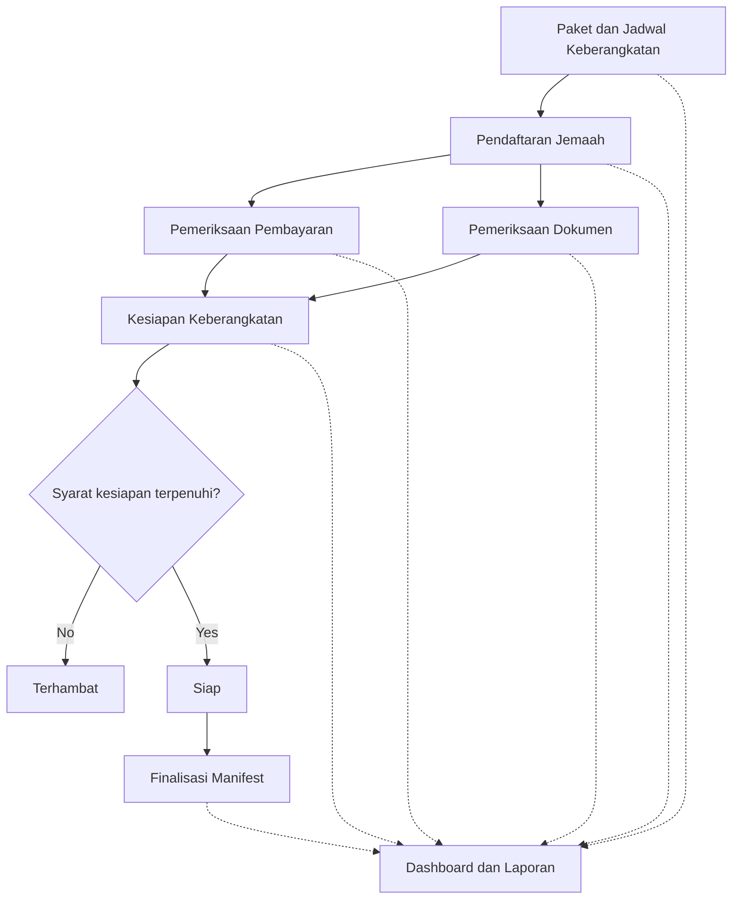

# CES-GF-ATLAS-HARD-027 - First Golden Main Workflow Projection

## Status

Ready for qualification implementation; production remediation remains owned
by ATLAS-HARD-019 through ATLAS-HARD-026

## Priority

High

## Depends On

- `ATLAS-HARD-018`
- `ATLAS-HARD-019`
- `ATLAS-HARD-020`
- `ATLAS-HARD-021`
- `ATLAS-HARD-022`
- `ATLAS-HARD-023`
- `ATLAS-HARD-024`
- `ATLAS-HARD-025`
- `ATLAS-HARD-026`

## Blocks

- `ATLAS-HARD-015`
- Atlas workflow UI golden-fixture qualification
- Buyer-facing project overview qualification

---

# Governing Corrections

The following rules are authoritative over any illustrative wording later in
this ticket:

1. Atlas preserves the original document text exactly, regardless of language.
2. Semantically equivalent content in different languages produces one
   governed semantic concept and one buyer-facing node, while every exact
   original representation remains available as evidence.
3. Canonical and display languages are project-configurable. No production
   rule assumes Indonesian, English, or any other document language.
4. The golden fixture may expect Indonesian display labels because that
   particular source document is Indonesian. Those labels are fixture
   expectations, not production constants.
5. Registration enables payment review and document review as independent or
   parallel paths; it does not model them as mutually exclusive branches.
6. Readiness evaluation connects to an explicit governed decision. `Ready` and
   `Blocked` are labeled conditional outcomes, not unconditional states
   produced together.
7. Reporting dependencies use `provides_data_to` from a source workflow to the
   reporting workflow. Projection arrow direction must match canonical
   relationship direction.
8. HARD-027 is an integrated qualification ticket, not a second implementation
   path. Failures must be remediated in HARD-019 through HARD-026 according to
   the production contract owner.
9. Pending multilingual equivalence keeps separate proposed identities and
   separate authoritative nodes. Only an accepted human decision creates one
   approved logical identity and one buyer-facing node.
10. Safara semantic IDs and expected labels belong only to fixture data,
    tests, qualification oracles, and reports. They are forbidden as Atlas
    core enums, switches, forced workflow kinds, or topology shortcuts.
11. English canonical examples in this ticket are Safara fixture
    configuration, not Atlas production defaults.
12. Before qualifying a workflow, Atlas must determine which model kinds the
    document evidence supports. Safara's workflow golden is one supported
    projection of one shared canonical semantic graph, not the universal Atlas
    output.

## Qualification Ownership

HARD-027 owns:

```text
Safara golden semantic and topology oracles
multilingual golden expectations
non-travel regression fixtures
anti-overfitting checks
integrated qualification reports
```

The Safara oracle expects independent evidence-backed support assessments for:

```text
business workflow
module dependency
state diagram
decision model
actor interaction
```

The checks are non-exclusive. A positive workflow result must not prevent
classification of the other supported model kinds. Every projection reuses
the same canonical identities, and the integrated graph relates their typed
nodes and governed edges.

HARD-027 must not implement a workflow normalizer, language engine, topology
generator, relationship engine, projection builder, or approval materializer.
Those production contracts remain owned by HARD-019 through HARD-026.

---

# 1. Problem

Atlas now produces:

```text
atomic claims
canonical semantic records
workflows
operations
workflow assignments
workflow edges
relationship candidates
per-workflow projections
Mermaid artifacts
```

However, the current Safara output does not yet produce a semantically correct buyer-facing main workflow.

The existing workflow inventory is fragmented and contains:

- duplicated workflow areas;
- requirement sentences used as workflow titles;
- missing business areas;
- incorrect workflow membership;
- source-order edges treated as process order;
- disconnected or misleading project-level topology;
- no qualified golden example for the intended buyer view.

Atlas needs one first golden project-overview result that proves it can compile a recognizable business workflow from source-grounded semantics without hardcoding Safara-specific logic.

---

# 2. Core Boundary

Safara is the first qualification fixture.

Safara is not the extraction algorithm.

The intended distinction is:

```text
Safara
  First golden test case used to prove expected Atlas behavior.

Atlas
  Domain-neutral workflow and semantic compiler that derives
  project-specific workflows from any supported PRD.
```

The expected Safara workflow must exist only as:

```text
test fixture
qualification expectation
semantic acceptance target
```

It must not exist as:

```text
production template
hardcoded workflow map
domain keyword switch
project-specific compiler branch
fallback topology
```

The governing rule is:

> Safara defines the first expected result, not the extraction algorithm.

---

# 3. Goal

Generate the first qualified Safara buyer-facing main workflow projection:

```text
Package and Departure Schedule
             |
             v
      Pilgrim Registration
         /         \
        v           v
Payment Review   Document Review
        \           /
         v         v
       Travel Readiness
          /      \
         v        v
     Blocked     Ready
                    |
                    v
          Manifest Finalization

Dashboard and Reports
  <- receives status and data from all major workflows
```

This projection must be derived from the canonical Atlas model and governed relationships.

It must not be generated from:

- fixed Safara workflow names;
- hardcoded node IDs;
- project-name checks;
- filename-specific rules;
- document page order alone;
- manually embedded Mermaid text;
- UI-side relationship inference;
- Indonesian travel-specific keyword matching used to force topology.

---

# 4. Buyer Language Policy

The buyer-facing projection must follow this language contract:

> Atlas preserves the original document text exactly. Buyer labels use the
> original source language where a source-grounded label exists. CES-generated
> relationships, policy names, and governance explanations use English.

For an Indonesian PRD:

## 4.1 Original Document Language

Use original or source-language labels for:

```text
workflow names
operation names
business rules
validations
permissions
states
calculations
reports
source quotations
```

Examples:

```text
Paket dan Jadwal Keberangkatan
Pendaftaran Jemaah
Pemeriksaan Pembayaran
Pemeriksaan Dokumen
Kesiapan Keberangkatan
Terhambat
Siap
Finalisasi Manifest
Dashboard dan Laporan
```

Example validation:

```text
NIK harus terdiri dari 16 angka apabila diisi.
```

Atlas must not replace it in the buyer view with:

```text
NIK must contain exactly 16 digits when provided.
```

A configured canonical-language statement may remain available as secondary
metadata. The configured canonical language is not assumed to be English.

## 4.2 Multilingual Semantic Deduplication

Semantically equivalent content in different languages must produce one
governed semantic concept rather than duplicate workflow nodes, operations,
rules, states, or relationships.

```text
one semantic concept
-> one buyer-facing node
-> several exact original document representations
```

Every representation retains:

```text
exact original document text
detected language
source document
source unit
text span
page and bounding box when available
```

Uncertain cross-language equivalence remains reviewable. The UI may present one
possible-duplicate review group, but authoritative consolidation occurs only
through accepted equivalence decisions. Rejecting equivalence separates the
concepts without losing either original representation.

## 4.3 English CES Vocabulary

Use English for CES-generated relationship and governance labels:

```text
precedes
enables
joins at
requires state
produces state
contributes to
provides data to
derived
explicit
pending review
approved
confidence
source evidence
```

Use English for CES policy names:

```text
INPUT_VALIDATION
RESOURCE_LEVEL_AUTHORIZATION
AUDIT_LOGGING
DUPLICATE_TRANSACTION_PREVENTION
```

## 4.4 Display Priority

The buyer view must prioritize:

```text
1. Exact original document wording
2. Original source reference
3. CES relationship explanation
4. CES policy coverage
5. Configured canonical-language interpretation
6. Technical identifiers
```

---

# 5. Golden Safara Main Workflow

## 5.1 Golden Business Nodes

The first qualified overview must contain semantic equivalents for these
business areas. Because this qualification document is Indonesian, its
source-grounded display labels are Indonesian where available:

```text
Paket dan Jadwal Keberangkatan
Pendaftaran Jemaah
Pemeriksaan Pembayaran
Pemeriksaan Dokumen
Kesiapan Keberangkatan
Terhambat
Siap
Finalisasi Manifest
Dashboard dan Laporan
```

Equivalent source-grounded labels may be accepted when their semantic meaning is the same and the label is traceable.

Examples:

```text
Pembayaran Jemaah
instead of
Pemeriksaan Pembayaran
```

or:

```text
Dokumen Jemaah
instead of
Pemeriksaan Dokumen
```

The selected label must preserve the original document language and must not
silently change semantic meaning.

## 5.2 Golden Main Relationships

The qualified projection must represent:

```text
Paket dan Jadwal Keberangkatan
  precedes
Pendaftaran Jemaah

Pendaftaran Jemaah
  enables
Pemeriksaan Pembayaran

Pendaftaran Jemaah
  enables
Pemeriksaan Dokumen

Pemeriksaan Pembayaran
  contributes to
Kesiapan Keberangkatan

Pemeriksaan Dokumen
  contributes to
Kesiapan Keberangkatan

Kesiapan Keberangkatan
  evaluated by
Syarat kesiapan terpenuhi?

Syarat kesiapan terpenuhi?
  branches to [No]
Terhambat

Syarat kesiapan terpenuhi?
  branches to [Yes]
Siap

Siap
  enables
Finalisasi Manifest

all major workflow areas
  provides data to
Dashboard dan Laporan
```

## 5.3 Project Overview Mermaid

The generated projection should be semantically equivalent to:



The exact generated Mermaid text does not need to match byte-for-byte.

The semantic nodes and relationships must match the qualified golden meaning.

---

# 6. Anti-Overfitting Requirements

Atlas must remain domain-neutral.

## 6.1 Safara-Specific Data Location

Safara-specific labels are allowed only in:

```text
tests/fixtures/safara/
qualification fixtures
golden expected outputs
fixture documentation
test assertions
```

They are not allowed in:

```text
Atlas workflow compiler
workflow classifier
relationship generator
projection builder
canonical vocabulary registry
provider adapter
fallback topology generator
production configuration defaults
```

## 6.2 Forbidden Production Logic

The following are prohibited:

```ts
if (projectName === "safara") {
  createWorkflow("Pendaftaran Jemaah");
}
```

```ts
if (text.includes("jemaah")) {
  forceWorkflow("Pilgrim Registration");
}
```

```ts
if (documentName.includes("safara")) {
  applySafaraTopology();
}
```

Also prohibited:

```text
hardcoded page numbers
hardcoded source unit IDs
hardcoded node IDs
hardcoded workflow names
travel-specific topology templates
language-specific keyword chains used as semantic truth
```

## 6.3 Required Generic Concepts

Production Atlas code may understand only generic semantic concepts such as:

```text
business area
workflow
operation
actor action
decision
state
precondition
postcondition
dependency
parallel activity
join
loop
reporting consumer
```

Production Atlas relationship logic may use generic relationship kinds such as:

```text
precedes
enables
branches_to
joins_at
contributes_to
produces_state
requires_state
provides_data_to
```

## 6.4 Semantic Golden Matching

The golden test must not require exact display labels.

Incorrect:

```ts
expect(workflow.title).toBe("Pemeriksaan Pembayaran");
```

Preferred:

```ts
expectSemanticEquivalent(
  workflow,
  safaraOracle.concepts.paymentReview
);
```

The fixture-owned oracle checks semantic kind, source-grounded evidence,
configured display language, required relationships, and semantic equivalence
to accepted source labels. Its fixture concept ID must never become a
production Atlas enum or forced workflow type.

The display label may vary when it remains:

```text
source-grounded
semantically equivalent
reviewable
traceable
in the source language
```

## 6.5 Repository Scan

Add a scoped or AST-based test that scans executable Atlas core compiler logic
for fixture-only constants used in conditional routing, forced record or edge
creation, default topology, or provider/project-specific overrides.

Terms such as:

```text
Safara
Pendaftaran Jemaah
Kesiapan Keberangkatan
Finalisasi Manifest
jemaah
keberangkatan
```

may appear in:

```text
tests
fixtures
examples
qualification reports
documentation
localization resources
runtime user data
governed terminology packs
```

They must not control generic compiler topology. A terminology pack may assist
interpretation, but it cannot force a workflow or edge without semantic
evidence. Do not use an uncontrolled repository-wide raw-text scan.

---

# 7. Domain-Neutral Regression Fixture

HARD-027 must include at least one structurally different non-travel PRD fixture.

Recommended domains:

```text
hiring
invoice processing
purchase order processing
retail fulfillment
project management
healthcare administration
```

The second fixture does not need a fully polished final golden graph.

It must prove:

```text
Atlas does not emit Safara workflow names.
Atlas classifies supported model kinds from that fixture's evidence.
Atlas generates only the supported domain-appropriate projections.
Atlas uses the same canonical schemas.
Atlas uses the same relationship kinds.
Atlas preserves that PRD's original language.
Atlas does not require changes to Atlas core.
```

If workflow is supported, an example non-travel output may be:

```text
Candidate Application
        |
        v
Document Screening
        |
        v
Technical Interview
        |
        v
Offer Approval
        |
        v
Employee Onboarding
```

or:

```text
Purchase Order
        |
        v
Goods Receipt
        |
        v
Invoice Verification
        |
        v
Payment Approval
        |
        v
Financial Reporting
```

The regression suite must also include or permit a fixture with insufficient
workflow evidence but sufficient evidence for another model kind. That fixture
must not receive a fabricated workflow. Every fixture uses the same production
compiler path as Safara.

---

# 8. Required Canonical Representation

The Mermaid file is only a projection.

The authoritative proposed bundle must contain governed records.

For this fixture only:

```json
{
  "project_language_config": {
    "primary_source_language": "id",
    "display_language": "id",
    "canonical_language": "en"
  }
}
```

Production Atlas has no universal English canonical-language default.

## 8.1 Workflow Example

```json
{
  "workflow_id": "WF-PACKAGE-DEPARTURE",
  "semantic_concept": "package_departure_management",
  "display_label": "Paket dan Jadwal Keberangkatan",
  "display_language": "id",
  "canonical_label": "Package and Departure Schedule",
  "canonical_language": "en",
  "origin": "explicit",
  "source_unit_ids": [
    "SRC-SAFARA-PACKAGE-001"
  ],
  "review_status": "pending"
}
```

## 8.2 Parallel Enablement Relationship Example

```json
{
  "relationship_id": "REL-REGISTRATION-PAYMENT",
  "relationship_kind": "ces.relationship.enables",
  "fanout_group_id": "FANOUT-REGISTRATION-001",
  "path_semantics": "independent_non_exclusive",
  "from_id": "WF-PILGRIM-REGISTRATION",
  "to_id": "WF-PAYMENT-REVIEW",
  "display_label": "enables",
  "origin": "derived",
  "evidence_source_unit_ids": [
    "SRC-SAFARA-REGISTRATION-001",
    "SRC-SAFARA-PAYMENT-001"
  ],
  "rationale": "Registration creates the business context in which payment review is performed.",
  "confidence": 0.90,
  "review_status": "pending",
  "bulk_approval_eligible": false,
  "blockers": [
    "derived_project_topology_requires_review"
  ]
}
```

The registration-to-document relationship uses the same `fanout_group_id` and
path semantics. These edges are not mutually exclusive decision branches.

## 8.3 Readiness Decision Outcome Example

```json
{
  "relationship_id": "REL-READINESS-READY",
  "relationship_kind": "ces.relationship.branches_to",
  "from_id": "DECISION-TRAVEL-READINESS",
  "to_id": "STATE-READY",
  "display_label": "Ready",
  "condition": "All governed readiness requirements are satisfied",
  "origin": "explicit",
  "evidence_source_unit_ids": [
    "SRC-SAFARA-READINESS-READY"
  ],
  "rationale": "The governed readiness decision selects the Ready outcome when its source-grounded conditions are satisfied.",
  "confidence": 1.0,
  "review_status": "pending",
  "bulk_approval_eligible": true,
  "blockers": []
}
```

## 8.4 Manifest Dependency Example

```json
{
  "relationship_id": "REL-MANIFEST-REQUIRES-READY",
  "relationship_kind": "ces.relationship.requires_state",
  "from_id": "WF-MANIFEST-FINALIZATION",
  "to_id": "STATE-READY",
  "display_label": "requires state",
  "origin": "explicit",
  "evidence_source_unit_ids": [
    "SRC-SAFARA-MANIFEST-READY"
  ],
  "rationale": "Only pilgrims in the Siap state may be included in the finalized manifest.",
  "confidence": 1.0,
  "review_status": "pending",
  "bulk_approval_eligible": true,
  "blockers": []
}
```

---

# 9. Workflow Discovery Requirements

Atlas must compile workflow areas from source-grounded semantics.

## 9.1 Normalize Requirement Sentences into Workflow Areas

Incorrect:

```text
Setiap perubahan pembayaran, dokumen, paspor, visa, asuransi,
atau tiket harus langsung memengaruhi status kesiapan.
```

as a workflow title.

Correct:

```text
Kesiapan Keberangkatan
```

with the full source sentence preserved as:

```text
business rule
trigger
relationship evidence
```

## 9.2 Consolidate Duplicate Workflow Areas

The compiler must propose consolidation for equivalent workflow areas such as:

```text
Pendaftaran ke keberangkatan terbuka
Pendaftaran administratif
Pendaftaran jemaah
```

into a canonical workflow area such as:

```text
Pendaftaran Jemaah
```

The consolidation must remain reviewable and source-traceable.

## 9.3 Do Not Promote Every Capability into a Main Workflow

A record becomes a project-overview workflow only when it represents a major business process area.

Detailed capabilities such as:

```text
record rejection reason
recalculate balance
validate NIK
preserve document history
```

belong under workflow detail tabs, not as project-overview workflow nodes.

## 9.4 Preserve Cross-Cutting Areas

These should not be forced into the main process sequence:

```text
Access and User Roles
Activity and Audit History
Privacy and Confidentiality
```

They should appear as:

```text
cross-cutting controls
supporting views
or side panels
```

unless the source explicitly defines them as process flows.

---

# 10. Topology Generation Requirements

The main workflow must not be generated from document order alone.

## 10.1 Required Evidence Sources

Topology may use:

```text
explicit source wording
state dependencies
operation preconditions
postconditions
workflow assignments
relationship candidates
accepted terminology equivalence
human-approved corrections
```

## 10.2 Required Relationship Families

```text
precedes
enables
branches_to
joins_at
contributes_to
produces_state
requires_state
provides_data_to
```

## 10.3 Endpoint Validation

Examples:

```text
precedes
  workflow -> workflow

branches_to
  decision -> workflow, operation, or state

enables
  workflow or state -> workflow or operation

joins_at
  workflow -> workflow or decision

produces_state
  workflow or operation -> state

requires_state
  workflow or operation -> state

provides_data_to
  workflow or canonical record -> report workflow
```

Invalid combinations must be rejected or surfaced for review.

## 10.4 Origin Rules

Every topology relationship must be classified as:

```text
explicit
derived
human_added
```

Derived overview topology must remain pending until reviewed.

---

# 11. Dashboard and Reports Semantics

`Dashboard dan Laporan` must not be treated as a strict final step that starts only after manifest finalization.

It should be modeled as a visibility and reporting area that receives data
from major workflows.

Recommended relationships:

```text
Paket dan Jadwal Keberangkatan
  provides data to
Dashboard dan Laporan

Pendaftaran Jemaah
  provides data to
Dashboard dan Laporan

Pemeriksaan Pembayaran
  provides data to
Dashboard dan Laporan

Pemeriksaan Dokumen
  provides data to
Dashboard dan Laporan

Kesiapan Keberangkatan
  provides data to
Dashboard dan Laporan

Finalisasi Manifest
  provides data to
Dashboard dan Laporan
```

In Mermaid, these may use dashed lines to distinguish reporting dependency from execution flow.

---

# 12. Buyer-Facing Projection Requirements

The generated buyer projection must:

- use the original document language for business nodes;
- use English for relationship labels;
- preserve exact source statements in detail views;
- show source references for every node and relationship;
- mark derived topology as pending;
- show approval status;
- avoid technical IDs by default;
- allow advanced users to inspect configured canonical-language statements;
- distinguish process flow from reporting dependency;
- distinguish workflow nodes, decisions, and states visually.

## 12.1 Example Buyer Node

```text
Pendaftaran Jemaah

Source:
PRD Safara, Section Pendaftaran

CES classification:
Workflow

Review status:
Pending
```

## 12.2 Example Buyer Rule

```text
NIK harus terdiri dari 16 angka apabila diisi.

Source:
PRD Safara, Data Jemaah

CES relationship:
constrains

Policy coverage:
INPUT_VALIDATION

Review status:
Pending
```

---

# 13. Required Output Artifacts

## 13.1 Proposed Golden Overview

```text
proposed-model-support-assessment.json
proposed-integrated-semantic-graph.json
proposed-model-projection-index.json
proposed-project-overview-graph.json
proposed-project-overview-graph.mmd
```

## 13.2 Golden Qualification Report

```text
safara-main-workflow-qualification.json
safara-main-workflow-qualification.md
```

## 13.3 Relationship Review

```text
proposed-project-overview-relationship-review.json
```

## 13.4 Source Traceability

```text
proposed-project-overview-traceability.json
```

## 13.5 Deterministic Fixtures

```text
tests/fixtures/safara/golden-main-workflow.json
tests/fixtures/safara/golden-main-workflow.mmd

tests/fixtures/non-travel/input.*
tests/fixtures/non-travel/expected-semantic-areas.json
```

The fixtures validate semantic meaning, not exact provider wording or volatile IDs.

## 13.6 Domain-Neutrality Evidence

```text
domain-neutral-regression-report.json
production-overfitting-scan-report.json
```

---

# 14. Qualification Contract

## 14.0 Supported Model Kinds

Before testing the Safara workflow topology, qualification must prove that
Atlas classified the document from source evidence:

```text
business_workflow: supported
module_dependency: supported
state_diagram: supported
decision_model: supported
actor_interaction: supported
```

Each result contains source evidence, rationale, confidence, and review state.
The workflow golden below is evaluated only because `business_workflow` is
supported.

## 14.1 Required Safara Semantic Areas

The qualification must verify the presence of semantic equivalents for:

```text
Paket dan Jadwal Keberangkatan
Pendaftaran Jemaah
Pemeriksaan Pembayaran
Pemeriksaan Dokumen
Kesiapan Keberangkatan
Terhambat
Siap
Finalisasi Manifest
Dashboard dan Laporan
```

## 14.2 Required Safara Topology

The qualification must verify:

```text
Package and Departure precedes Registration.

Registration enables Payment Review.

Registration enables Document Review.

Payment Review contributes to Travel Readiness.

Document Review contributes to Travel Readiness.

Travel Readiness is evaluated by a governed decision with labeled Ready and
Blocked outcomes.

Ready enables Manifest Finalization.

Major workflow areas provide data to Dashboard and Reports.
```

## 14.3 Required Domain-Neutral Evidence

The qualification must also verify:

```text
The non-travel fixture does not emit Safara workflow names.

The non-travel fixture produces only its evidence-supported,
domain-appropriate model projections.

Both fixtures use the same production compiler.

Both fixtures use the same canonical schemas.

Both fixtures use the same relationship vocabulary.

No Atlas core change is required between fixture runs.
```

## 14.4 Negative Requirements

The qualification must fail when:

```text
workflow edges are empty

all workflow titles are full requirement sentences

payment recording is assigned as a Manifest operation

registration cancellation precedes registration without explicit evidence

readiness statements are chained as duplicate operations

Dashboard and Reports is represented only as a strict final process step

pending relationships are shown as authoritative

business labels are replaced by English translations in buyer view

semantically equivalent multilingual content appears as duplicate workflow
nodes, operations, rules, states, or relationships

deduplication removes or rewrites an original document representation

the result depends on Safara-specific hardcoded node names

production code contains fixture-specific workflow constants

the non-travel fixture emits Safara-specific workflows
```

---

# 15. Acceptance Criteria

## 15.0 Model-Kind Classification

```md
- [ ] Model-kind classification runs before diagram generation.
- [ ] Model kinds are assessed independently rather than through a
      first-match-wins decision.
- [ ] Safara's workflow, module, state, decision, and actor projections reuse
      canonical identities from one semantic graph.
- [ ] Unsupported projections are not fabricated.
```

## 15.1 Workflow Normalization

```md
- [ ] The Safara overview contains the required major semantic areas.
- [ ] Duplicate registration workflows are consolidated or flagged.
- [ ] Duplicate readiness workflows are consolidated or flagged.
- [ ] Workflow titles are concise business areas, not complete rule sentences.
- [ ] Cross-cutting controls are not forced into the main sequence.
```

## 15.2 Topology

```md
- [ ] The main overview contains connected governed edges.
- [ ] Registration enables independent payment and document review paths.
- [ ] Registration's enabled paths share fanout metadata marking them
      independent and non-exclusive.
- [ ] Payment and document review converge on readiness.
- [ ] A governed readiness decision has labeled `Siap` and `Terhambat`
      outcomes.
- [ ] `Siap` enables manifest finalization.
- [ ] Major workflows provide data to dashboard and reports through
      non-sequential relationships.
- [ ] No topology edge is created only from document order.
```

## 15.3 Language

```md
- [ ] Buyer-facing business labels use the original document language.
- [ ] Exact original document statements remain unchanged.
- [ ] CES relationship labels use English.
- [ ] CES policy names and explanations use English.
- [ ] Configured canonical-language statements remain secondary.
- [ ] Derived source-language labels are marked as derived.
- [ ] Translation never replaces source evidence.
- [ ] Same-meaning multilingual representations produce one governed semantic
      concept and one buyer-facing node.
- [ ] Every exact original representation remains available as evidence.
- [ ] Uncertain equivalence remains reviewable before authoritative
      consolidation.
- [ ] Pending equivalence preserves separate record identities and separate
      authoritative nodes under a review-only equivalence cluster.
- [ ] Accepted equivalence produces one approved logical identity; rejected
      equivalence preserves separate approved logical identities.
- [ ] Primary display-label selection follows the deterministic HARD-020
      priority and is unchanged by candidate or provider ordering.
- [ ] English canonical labels are only Safara fixture configuration, never a
      production default.
```

## 15.4 Governance

```md
- [ ] Every project-level edge has origin.
- [ ] Every derived edge has rationale and confidence.
- [ ] Every edge is reviewable.
- [ ] Pending edges are visibly non-authoritative.
- [ ] Approved graphs contain only approved relationships.
- [ ] The original proposal remains immutable.
```

## 15.5 Projection

```md
- [ ] JSON and Mermaid overview artifacts are generated.
- [ ] Mermaid is regenerated from canonical records and governed edges.
- [ ] The overview is smaller than the complete semantic inventory.
- [ ] Detailed rules remain available through workflow detail projections.
- [ ] Source navigation resolves for all golden workflow nodes and edges.
```

## 15.6 Determinism

```md
- [ ] Repeating the same run produces semantically equivalent golden output.
- [ ] Provider candidate ordering does not change the golden topology.
- [ ] Display-language rendering does not change canonical identity.
- [ ] Volatile timestamps and run IDs do not affect semantic comparison.
```

## 15.7 Anti-Overfitting

```md
- [ ] No production source file contains Safara-specific workflow labels,
      project IDs, document names, page numbers, or domain keywords used
      to force the golden topology.

- [ ] Safara-specific values exist only in fixtures, tests, examples,
      qualification reports, and documentation.

- [ ] Golden matching uses semantic concepts and source-grounded
      relationships rather than exact display labels.
- [ ] Golden matching uses fixture-owned oracle records; Safara fixture concept
      IDs do not exist as production enums, switches, or topology shortcuts.
- [ ] The anti-overfitting scan targets executable Atlas core behavior and
      permits fixture values in tests, fixtures, documentation, localization,
      runtime data, and governed terminology packs.
- [ ] Governed terminology packs may assist interpretation but cannot force
      topology without semantic evidence.
- [ ] HARD-027 contains fixtures, assertions, scans, and reports only; every
      production failure is assigned to its owning HARD-019 through HARD-026
      contract.

- [ ] A structurally different non-travel PRD passes through the same
      compiler and produces only evidence-supported, domain-appropriate model
      projections.
- [ ] A fixture without sufficient workflow evidence produces no fabricated
      workflow and can still qualify through other supported model kinds.

- [ ] The non-travel fixture does not produce Safara-specific workflow
      labels or travel-domain concepts.

- [ ] Atlas core requires no configuration or source-code change when
      switching between Safara and the non-travel fixture.
```

---

# 16. Test Scenarios

## 16.1 Positive Safara Golden Test

Input:

```text
Safara buyer PRD
```

Expected:

```text
A connected main workflow equivalent to the Safara golden overview.
```

## 16.2 Duplicate Workflow Test

Input contains several equivalent registration or readiness statements.

Expected:

```text
One normalized workflow area with multiple source references,
or a reviewable consolidation proposal.
```

## 16.3 Source-Order Trap Test

Input places cancellation before registration in document order.

Expected:

```text
Atlas must not infer Cancel Registration -> Register Pilgrim
without semantic evidence.
```

## 16.4 Reporting Test

Input contains dashboard and reporting requirements across modules.

Expected:

```text
Multiple workflows provide data to Dashboard and Reports
and is not modeled only as the final sequential step.
```

## 16.5 Language Test

Input PRD is Indonesian.

Expected:

```text
Business labels and statements remain Indonesian.
Relationships and policy metadata remain English.
```

## 16.6 Domain-Neutral Regression Test

Input:

```text
A structurally different non-travel PRD.
```

Expected:

```text
Atlas classifies model support from source semantics and generates only
supported model projections.

Atlas does not emit:
Pendaftaran Jemaah
Kesiapan Keberangkatan
Finalisasi Manifest
or other Safara-specific workflow labels.

Atlas uses the same schemas, relationship types, and compiler path. If
workflow evidence is insufficient, Atlas emits no workflow projection.
```

## 16.7 Production Constant Scan

Input:

```text
Atlas production source directories
```

Expected:

```text
No Safara-specific fixture constants exist in generic compiler logic.
```

---

# 17. Implementation Guidance

Recommended qualification sequence:

```text
1. Freeze the fixture-owned Safara semantic and topology oracle.
2. Freeze pending, accepted, and rejected multilingual expectations.
3. Freeze deterministic display-label expectations.
4. Freeze the structurally different non-travel fixture.
5. Add semantic, topology, traceability, and projection assertions.
6. Add the scoped production overfitting scan.
7. Run both fixtures through the existing production compiler.
8. Attribute each failure to HARD-019 through HARD-026.
9. Remediate failures only in the owning production contract.
10. Produce integrated qualification and domain-neutral regression reports.
```

Do not increase extraction breadth until the golden overview is semantically correct.

---

# 18. Non-Goals

This ticket does not require:

- workflow execution;
- BPMN export;
- application code generation;
- architecture generation;
- policy implementation;
- automatic approval;
- final UI production qualification;
- hardcoded Safara workflow rules;
- a universal fixed workflow taxonomy.

This ticket establishes one correct project-overview semantic target and proves the generic Atlas pipeline can derive it.

---

# 19. HARD-015 Integration

`ATLAS-HARD-015` must remain blocked until this ticket passes.

The Safara qualification gate must verify:

```text
golden workflow areas present
golden topology present
original-document-language buyer labels present
multilingual semantic deduplication proven
all exact original document representations retained
English CES relationship vocabulary present
source traceability complete
pending relationships non-authoritative
approved topology materialization proven
domain-neutral regression passes
production constant scan passes
```

A non-empty workflow graph is not sufficient.

A readable but semantically incorrect Mermaid diagram is not sufficient.

A Safara graph produced by Safara-specific production logic is not sufficient.

The generated overview must be source-grounded, reviewable, deterministic, domain-neutral, and recognizable to the buyer.

---

# Final Requirement

Atlas must produce one first qualified buyer-facing Safara project overview equivalent to:

```text
Paket dan Jadwal Keberangkatan
             |
             v
      Pendaftaran Jemaah
         /         \
        v           v
Pemeriksaan       Pemeriksaan
Pembayaran        Dokumen
        \           /
         v         v
    Kesiapan Keberangkatan
          /      \
         v        v
    Terhambat    Siap
                   |
                   v
         Finalisasi Manifest

Dashboard dan Laporan
  <- receives data from all major workflows
```

Business content must remain in the original document language.

CES-generated relationships, policy names, and governance explanations must remain in English.

The result must be derived dynamically from canonical source-grounded semantics.

Safara-specific labels and expected topology may exist only in qualification fixtures and tests.

The Atlas production compiler must remain domain-neutral and must derive only
the model kinds supported by a structurally different non-travel PRD without
changes to Atlas core.
